# Extended Expeditions

## Archeological Item Pools

  
Enbesa

- Uncommon/Common

  - 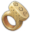 Bovine Ivory Ring
  -  Arabesque Trinkets
  - 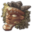 Painted Mask
  - 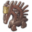 Animal Figure
  -  Glory of Kings

- Rare

  -  Lion of Selamawi
  - 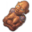 Mother and Child Figure
  - 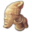 Striking Terracotta Figure
  - 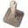 Arksum Obelisk
  - 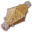 Masu Masu's Trinket
  - 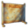 Masu's Mapamundi
  -  Intricate Baked Mud Tile

    
Arctic

- Rare

  -  🟦 Collection Of Lost Expedition Relics
  - 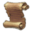 Heimskringla
  -  Inunnguaq Inuksuk
  - 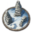 Pirujaqarvik Inuksuk
  - 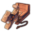 Toy Qamutiik

## Botanical Item Pools

  
Enbesa (Only with the mod "Fams Enbesan Flora")

- Uncommon/Common

  - 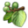 Old Wanza Tree
  - 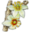 Frankincense
  -  Gazania
  -  Cape Periwinkle

- Rare

  -  Lion's Ear
  - 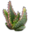 Aloe
  -  Wild Custard Apple
  - 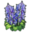 Spur Flower
  -  Ironwood Olive Tree
  - 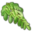 Moringa Tree

