# Extended Expeditions

##  Archeological Items

  
 Enbesa

-  "Archeological Research Report from Enbesa: Uncommon Artefacts"

  -  Bovine Ivory Ring
  -  Arabesque Trinkets
  -  Painted Mask
  -  Animal Figure
  -  Glory of Kings

-  "Archeological Research Report from Enbesa: Rare Artefacts"

  -  Lion of Selamawi
  -  Mother and Child Figure
  -  Striking Terracotta Figure
  -  Arksum Obelisk
  -  Masu Masu's Trinket
  -  Masu's Mapamundi
  -  Intricate Baked Mud Tile

    
 Arctic

-  "Archeological Research Report of the Arctic: Rare Artefacts"

  -  Collection Of Lost Expedition Relics
  -  Heimskringla
  -  Inunnguaq Inuksuk
  -  Pirujaqarvik Inuksuk
  -  Toy Qamutiik

##  Botanical Items

  
 Enbesa (Only with the mod "Fams Enbesan Flora")

-  "Botanical Research Report from Enbesa: Uncommon Plants"

  -  Old Wanza Tree
  -  Frankincense
  -  Gazania
  -  Cape Periwinkle

-  "Botanical Research Report from Enbesa: Rare Plants"

  -  Lion's Ear
  -  Aloe
  -  Wild Custard Apple
  -  Spur Flower
  -  Ironwood Olive Tree
  -  Moringa Tree

  
 New World

-  "Botanical Research Report of the New World: Uncommon Plants"

  - 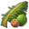 Coconut Palm
  - 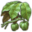 Hevea Tree
  - 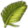 Royal Palm
  -  Sea-lavender
  - 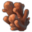 Pillar Coral
  - 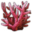 Staghorn Coral

-  "Botanical Research Report of the New World: Rare Plants"

  - 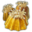 Great Star Coral
  -  Yellow Lotus
  - 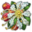 Guayacan de Manizales
  - 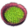 Giant Water Lily
  -  Metaxya Farn
  - 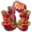 Purple Pitcher Plant
  - 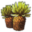 Espeletia
  - 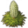 Queen of the Andes
  - 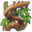 Sea Heart Liana

  
 Old World

-  "Botanical Research Report of the Old World: Uncommon Plants"

  - 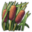 Common Reed
  - 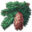 Subalpine Fir
  -  Foxglove
  - 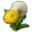 Dandelion
  - 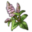 Peppermint
  - 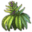 Hemp
  -  Poopy
  -  Purple Saxifage
  - 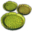 Water Lily
  - 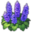 Meadow Sage

  
 Asia

-  "Botanical Research Report from Asia: Uncommon Plants"

  - 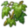 Morning Glory
  - 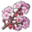 Oriental Cherry
  -  Rhododendron
  -  Papyrus
  - 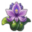 Water Hyacinth
  - 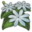 Star Jasmine
  - 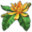 Champak
  - 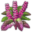 Tulsi

##  Zoological Items

  
 Enbesa

-  "Zoological Research Trip to Enbesa: Uncommon Animals"

  - 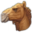 Dromedary
  - 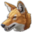 Enbesan Wolf
  - 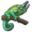 Two-Horned Chameleon
  - 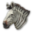 Imperial Zebra
  - 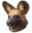 Wild Dog
  - 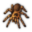 Curly-Hair Tarantula
  - 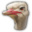 Ostrich
  -  Flamingo

- 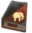 "Zoological Research Report from Enbesa: Rare Animals"

  - 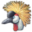 Grey Crowned Crane
  - 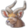 Mountain Nyala
  - 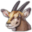 Oryxe
  - 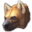 Spotted Hyena
  - 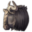 Wildebeest
  - 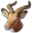 Impala
  - 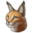 Caracal
  - 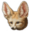 Feccec
  - 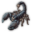 Emperor Scorpion
  - 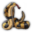 Spitting Cobra
  - 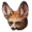 Bat-Eared Fennec

  
 New World

-  "Zoological Research Report of the New World: Uncommon Animals"

  - 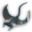 Manta Ray
  - 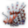 Lionfish
  - 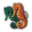 Seahorses
  - 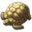 Green Turtle
  - 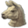 Alpaca
  - 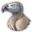 Condor

-  "Zoological Research Report of the New World: Rare Animals"

  -  Bottlenose Dolphin
  -  Balloon Fish
  -  Glossy Black Cockatoo
  -  Puma
  -  Jaguar
  -  Pelican
  -  Black Caiman

  
 Old World 

-  "Zoological Research Report of the Old World: Uncommon Animals"

  -  Domestic Pig
  -  Chicken
  -  Horse
  -  Cattle
  -  Sheap
  -  Goat
  -  Brown Bear
  -  Black Bear

-  "Zoological Research Report of the Old World: Rare Animals"

  -  Blobfish
  -  Helmet Jellyfish
  -  Orca
  -  Swordfish
  -  Elk

    
 Arctic

-  "Zoological Research Report of the Arctic: Rare Animals"

  -  Arctic Wolf
  -  Musk Ox
  -  Boreal Carobou

  
 Asia

-  "Zoological Research Report from Asia: Uncommon Animals"

  -  Chital
  -  Crocodile
  -  Peacock
  -  Eastern Water Buffalo

-  "Zoological Research Report from Asia: Rare Animals"

  -  Tiger
  -  Deep-Sea Dragonfish
  -  Unknown Luminescent Fish
  -  Firefly Squid

