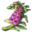
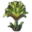

# Extended Expeditions

## Archeological Items

  
Enbesa

- "Archeological Research Report from Enbesa: Uncommon Artefacts"

  - Bovine Ivory Ring
  - Arabesque Trinkets
  - Painted Mask
  - Animal Figure
  - Glory of Kings

- "Archeological Research Report from Enbesa: Rare Artefacts"

  - Lion of Selamawi
  - Mother and Child Figure
  - Striking Terracotta Figure
  - Arksum Obelisk
  - Masu Masu's Trinket
  - Masu's Mapamundi
  - Intricate Baked Mud Tile

    
Arctic

- "Archeological Research Report of the Arctic: Rare Artefacts"

  - Collection Of Lost Expedition Relics
  - Heimskringla
  - Inunnguaq Inuksuk
  - Pirujaqarvik Inuksuk
  - Toy Qamutiik

## Botanical Items

  
Enbesa (Only with the mod "Fams Enbesan Flora")

- "Botanical Research Report from Enbesa: Uncommon Plants"

  - Old Wanza Tree
  - Frankincense
  - Gazania
  - Cape Periwinkle

- "Botanical Research Report from Enbesa: Rare Plants"

  - Lion's Ear
  - Aloe
  - Wild Custard Apple
  - Spur Flower
  - Ironwood Olive Tree
  - Moringa Tree

  
New World

- "Botanical Research Report of the New World: Uncommon Plants"

  - Coconut Palm
  - Hevea Tree
  - Royal Palm
  - Sea-lavender
  - Pillar Coral
  - Staghorn Coral

- "Botanical Research Report of the New World: Rare Plants"

  - Great Star Coral
  - Yellow Lotus
  - Guayacan de Manizales
  - Giant Water Lily
  - Metaxya Farn
  - Purple Pitcher Plant
  - Espeletia
  - Queen of the Andes
  - Sea Heart Liana

  
Old World

- "Botanical Research Report of the Old World: Uncommon Plants"

  - Common Reed
  - Subalpine Fir
  - Foxglove
  - Dandelion
  - Peppermint
  - Hemp
  - Poopy
  - Purple Saxifage
  - Water Lily
  - Meadow Sage

  
Asia

- "Botanical Research Report from Asia: Uncommon Plants"

  - Morning Glory
  - Oriental Cherry
  - Rhododendron
  - Papyrus
  - Water Hyacinth
  - Star Jasmine
  - Champak
  - Tulsi

## Zoological Items

  
Enbesa

- "Zoological Research Trip to Enbesa: Uncommon Animals"

  - Dromedary
  - Enbesan Wolf
  - Two-Horned Chameleon
  - Imperial Zebra
  - Wild Dog
  - Curly-Hair Tarantula
  - Ostrich
  - Flamingo

- "Zoological Research Report from Enbesa: Rare Animals"

  - Grey Crowned Crane
  - Mountain Nyala
  - Oryxe
  - Spotted Hyena
  - Wildebeest
  - Impala
  - Caracal
  - Feccec
  - Emperor Scorpion
  - Spitting Cobra
  - Bat-Eared Fennec

  
New World

- "Zoological Research Report of the New World: Uncommon Animals"

  - Manta Ray
  - Lionfish
  - Seahorses
  - Green Turtle
  - Alpaca
  - Condor

- "Zoological Research Report of the New World: Rare Animals"

  - Bottlenose Dolphin
  - Balloon Fish
  - Glossy Black Cockatoo
  - Puma
  - Jaguar
  - Pelican
  - Black Caiman

  
Old World

- "Zoological Research Report of the Old World: Uncommon Animals"

  - Domestic Pig
  - Chicken
  - Horse
  - Cattle
  - Sheap
  - Goat
  - Brown Bear
  - Black Bear

- "Zoological Research Report of the Old World: Rare Animals"

  - Blobfish
  - Helmet Jellyfish
  - Orca
  - Swordfish
  - Elk

    
Arctic

- "Zoological Research Report of the Arctic: Rare Animals"

  - Arctic Wolf
  - Musk Ox
  - Boreal Carobou

  
Asia

- "Zoological Research Report from Asia: Uncommon Animals"

  - Chital
  - Crocodile
  - Peacock
  - Eastern Water Buffalo

- "Zoological Research Report from Asia: Rare Animals"

  - Tiger
  - Deep-Sea Dragonfish
  - Unknown Luminescent Fish
  - Firefly Squid

