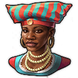

# Item Overhaul

##  Trade Union Rebalanced

- 

  
Legendary

  - 
<!-- Aaden Issack, World-Famous Enbesan Chef -->
    
 Aaden Issack, World-Famous Enbesan Chef

      

      When a population consumes Jacob's "**Canned Fish**", "**Canned Food**" is exchanged for it.
      
    

  - 
<!-- Belinda San Pedro, Head of Arcade Acquisitions -->
    
 Belinda San Pedro, Head of Arcade Acquisitions

      
    

  - 
<!-- Brother Hilarius, Purveyor of Monastic Mixtures -->
    
 Brother Hilarius, Purveyor of Monastic Mixtures

      
    

  - 
<!-- Bruno Ironbright, Engineering Giant -->
    
 Bruno Ironbright, Engineering Giant

      
    

  - 
<!-- Bumm Brimmell, the Original Dandy -->
    
 Bumm Brimmell, the Original Dandy

      
    

  - 
<!-- Calla Lily, Of The Desert Bloom -->
    
 Calla Lily, Of The Desert Bloom

      
    

  

- 

  
Epic

  

##  Town Hall Rebalanced

- 

  
Legendary

  

- 

  
Epic

  

- 

  
Rare/Uncommon

  

