# Item Overhaul

##  Trade Union Rebalanced

- 

  
Legendary

  - 
<!-- Aaden Issack, World-Famous Enbesan Chef -->
    
 Aaden Issack, World-Famous Enbesan Chef

      

      When a population consumes Jacob's "**Sardines**", "**Canned Food**" is exchanged for it.
      
    

  - 
<!-- Belinda San Pedro, Head of Arcade Acquisitions -->
    
 Belinda San Pedro, Head of Arcade Acquisitions

      
    

  - 
<!-- Brother Hilarius, Purveyor of Monastic Mixtures -->
    
 Brother Hilarius, Purveyor of Monastic Mixtures

      
    

  - 
<!-- Bruno Ironbright, Engineering Giant -->
    
 Bruno Ironbright, Engineering Giant

      
      
      
    

  - 
<!-- Bumm Brimmell, the Original Dandy -->
    
 Bumm Brimmell, the Original Dandy

      
    

  - 
<!-- Calla Lily, Of The Desert Bloom -->
    
 Calla Lily, Of The Desert Bloom

      
    

  - 
<!-- Cosmo Castelli, Agronomic Trailblazer -->
    
 Cosmo Castelli, Agronomic Trailblazer

      
      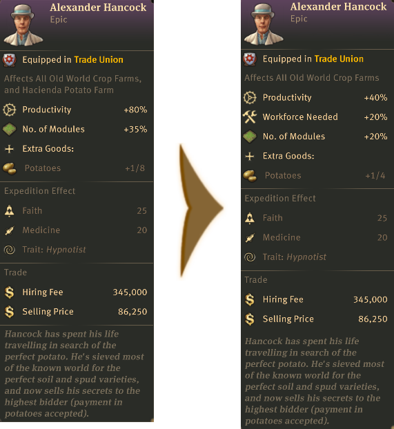
      
      
      
      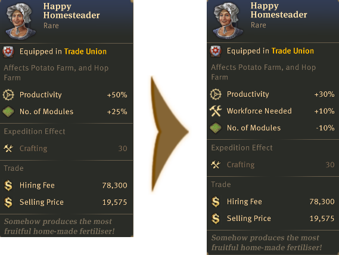
    

  - 
<!-- Cristobal Taffeta, The Trendsetter -->
    
 Cristobal Taffeta, The Trendsetter

      
      

      When a population consumes Jacob's "**Suits**", "**Tailored Suits**" are exchanged for them.
      
    

  - 
<!-- Dr. Ali Al-Zahir, the Botanical Director -->
    
 Dr. Ali Al-Zahir, the Botanical Director

      
    

  - 
<!-- Francois Strindberg, Crown Jeweller -->
    
 Francois Strindberg, Crown Jeweller

      
      
      
      
    

  - 
<!-- Francois Thorne, The Industrial Reinforcer -->
    
 Francois Thorne, The Industrial Reinforcer 

      
      
    

  - 
<!-- Gennaro Garibaldi, Chocolatier by Royal Appointment -->
    
 Gennaro Garibaldi, Chocolatier by Royal Appointment 

      
      
      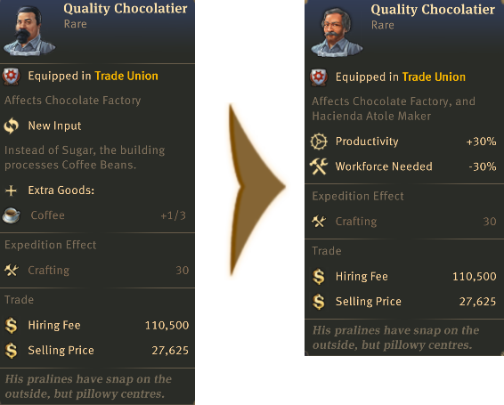
    

  - 
<!-- Fried Plantain Kitchen Items -->
    
 Fried Plantain Kitchen Items 

      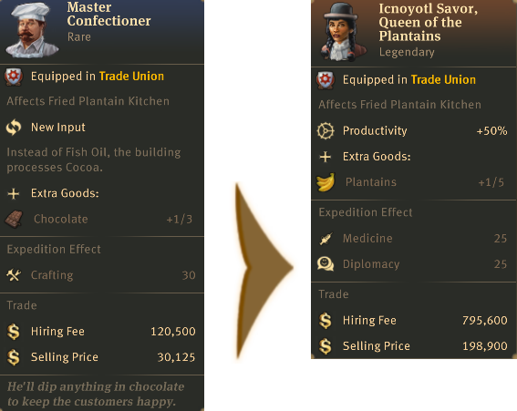
      
      
    

  - 
<!-- Gerhard Fuchs, of the Patent Eyeglass -->
    
 Gerhard Fuchs, of the Patent Eyeglass 

      
      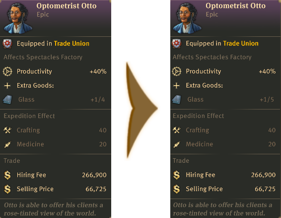
    

  - 
<!-- Giorgis, the Eminent Hymnodist -->
    
 Giorgis, the Eminent Hymnodist 

      
    

  - 
<!-- Hans Klein, Old Grandfather Time -->
    
 Hans Klein, Old Grandfather Time 

      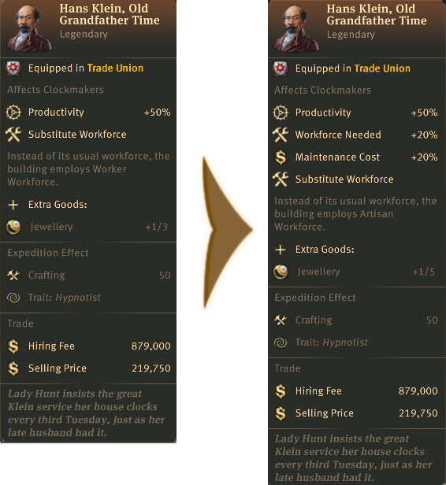
      
      
      
    

  - 
<!-- Herve Savonne, Suppressor of Grime -->
    
 Herve Savonne, Suppressor of Grime 

      
      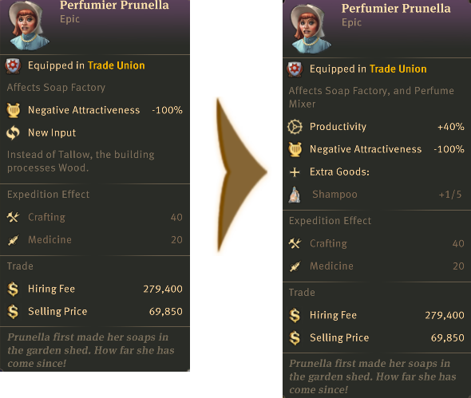
    

  - 
<!-- Jörg von Malching, Augur of the Auric -->
    
 Jörg von Malching, Augur of the Auric 

      
      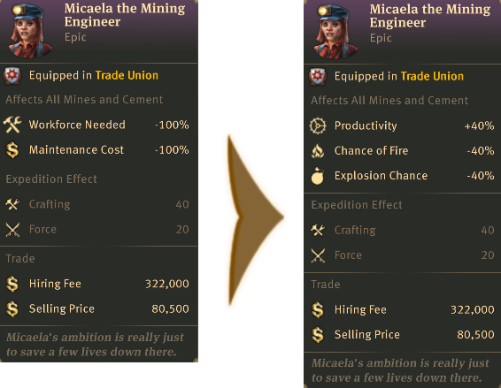
      
    

  - 
<!-- Lady Jane Smythe, Queen of Haute Couture -->
    
 Lady Jane Smythe, Queen of Haute Couture 

      
    

  - 
<!-- Marcel Forcas, Celebrity Chef -->
    
 Marcel Forcas, Celebrity Chef 

      
      
    

  - 
<!-- Marco de la Mocha, Crusher of Beans -->
    
 Marco de la Mocha, Crusher of Beans 

      
      
      
    

  - 
<!-- Marie-Antoine, Patissier Royale -->
    
 Marie-Antoine, Patissier Royale 

      
      
      
    

  - 
<!-- Mark van der Mark, Breeder of Shepherd Dogs -->
    
 Mark van der Mark, Breeder of Shepherd Dogs 

      
      
      
      
    

  - 
<!-- Mrs. Mayson, The Very Good Housekeeper -->
    
 Mrs. Mayson, The Very Good Housekeeper 

      
      
    

  - 
<!-- Seraphim Papadikas, The Window Dresser -->
    
 Seraphim Papadikas, The Window Dresser 

      
      
    

  - 
<!-- Steven MacLeod, Geological Surveyor -->
    
 Steven MacLeod, Geological Surveyor 

      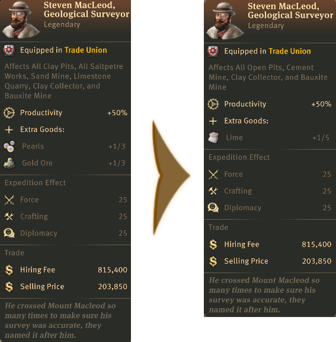
      
    

  - 
<!-- Susannah Brightwoman, A Glimmer In The Darkness -->
    
 Susannah Brightwoman, A Glimmer In The Darkness 

      
    

  - 
<!-- Tlayolotl Savor, King of the Corn -->
    
 Tlayolotl Savor, King of the Corn 

      
      
      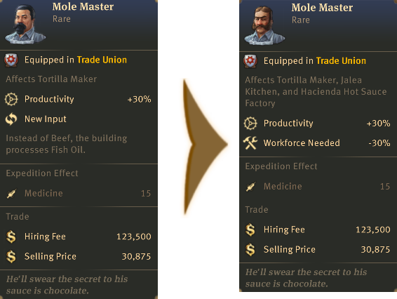
    

  - 
<!-- Victor Perfecto, Cigar Daddy -->
    
 Victor Perfecto, Cigar Daddy 

      
      
    

  

- 

  
Epic

  - 
<!-- Chantelle the Charcutier -->
    
 Chantelle the Charcutier 

      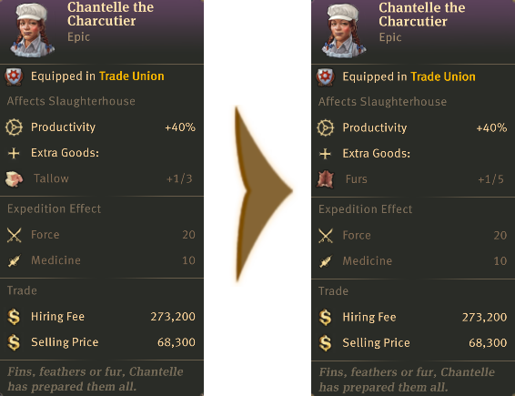
      
    

  

##  Town Hall Rebalanced

- 

  
Legendary

  

- 

  
Epic

  

- 

  
Rare/Uncommon

  

