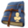
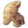
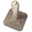
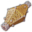
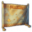

# Job Adertisements

##  Old World Items

  
 Trade Union

-  "Forestry"

  -  Bovine Ivory Ring
  -  Arabesque Trinkets
  -  Painted Mask
  -  Animal Figure
  -  Glory of Kings

-  "Carpenters"

  -  Lion of Selamawi
  -  Mother and Child Figure
  -  Striking Terracotta Figure
  -  Arksum Obelisk
  -  Masu Masu's Trinket
  -  Masu's Mapamundi
  -  Intricate Baked Mud Tile

