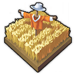
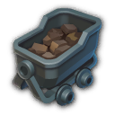
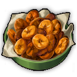
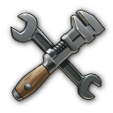
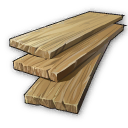

# Production Works

## Agriculture Works

<!-- List of Changes-->

List of Changes

- 
<!-- Some items for agriculture will be adapted. -->
  
Some items for agriculture will be adapted.

  - 
<!-- Old world plant specialists -->
    
Old world plant specialists

    - Cosmo Castelli, pioneer of agricultural science:
      - Has a new icon.
      - Only increases productivity by +50%.
      - Increases the required labour force by +50%.
      - Reduces the required number of modules by -25%.
      - Provides potato fertility.

    - Yvonne the Freedwoman:
      - Increases the required labour by +30%.
      - Reduces the required number of modules by -15%.
      - Provides grape fertility.
      - Affects all Old World crop farms.

    - Experienced planter:
      - Only increases productivity by +30%.
      - Increases the required labour force by +20%.
      - Reduces the required number of modules by -10%.
      - Provides hop fertility.
      - Affects all Old World crop farms.

    - Vegetable Farmer:
      - Increases productivity by +20%.
      - Increases the required labour force by +10%.
      - Reduces the required number of modules by -5%.
      - Provides pepper fertility.
      - Affects all Old World crop farms.

    - Cultivator:
      - Provides grain fertility.
      - Affects all useful plant farms in the Old World.

    - The following items will be removed:
      - Alexander Hancock, Father of the Potato.
      - Award-winning producer.
      - Sunny Settler.
      - Vintner.
      - Farmer.
      - Winemaker.
      - Arable farmer.
    

  - 
<!-- New World Plant Specialists -->
    
New World Plant Specialists

    - Dr Ali Al-Zahir, Botanical Director:
      - Increases productivity by +50% only.
      - Increases the required labour force by +50%.
      - Reduces the required number of modules by -25%.
      - Provides tobacco fertility.

    - Mrs Brown the farmer:
      - Increases the required labour by +30%.
      - Reduces the required number of modules by -15%.
      - Provides cotton fertility.
      - Affects all the New World's crop farms.

    - Soil Scientist:
      - Only increases productivity by +30%.
      - Increases the required labour force by +20%.
      - Reduces the required number of modules by -10%.
      - Provides cocoa fertility.
      - Affects all the New World's crop farms.

    - Farmer:
      - Increases productivity by +20%.
      - Increases the required labour force by +10%.
      - Reduces the required number of modules by -5%.
      - Provides rubber fertility.
      - Affects all New World crop farms.

    - Harvester:
      - Provides corn fertility.
      - Affects all New World crop farms.

    - The following items are removed:
      - Horticulturist Hermann.
      - Arborist.
      - Tree Surgeon.
      - Picker.
    

  - 
<!-- Enbesa plant specialists -->
    
Enbesa plant specialists

    - Calla Lily from the blooming desert:
      - Increases productivity by +50%.
      - Increases the required labour force by +50%.
      - Reduces the required number of modules by -25%.

    - Yebeba's Robust Greenhouse:
      - Increases productivity by +40%.
      - Increases the required labour force by +30%.
      - Reduces the required number of modules by -15%.
      - Provides hibiscus fertility.

    - Mosquito net:
      - Increases productivity by +30%.
      - Increases the required labour force by +20%.
      - Reduces the required number of modules by -10%.
      - Provides spice fertility.

    - Birdhouse:
      - Increases productivity by +20%.
      - Increases the required labour force by +10%.
      - Reduces the required number of modules by -5%.
      - Provides teff fertility.
    

  - 
<!-- Animal specialists -->
    
Animal specialists

    - Mark van der Mark, breeder of shepherd dogs:
      - Increases productivity by only +50%.
      - Increases the required labour force by +50%.
      - Reduces the required number of modules by -25%.
      - Does not produce any additional alpaca wool.

    - Rodrigo the Ranchero:
      - Increases productivity by +40%.
      - Reduces maintenance costs by -40%.
      - Does not produce any additional beef.

    - Cattle farmer:
      - Increases productivity by +30%.
      - Reduces labour costs by -30%.

    - Herdsman:
      - Increases productivity by +20%.
      - Reduces the labour force by -20%.
    

  - 
<!-- Enbesa Animal specialists -->
    
Enbesa Animal specialists

    - Loving herdsman:
      - Increases productivity by +30%.
      - Reduces the required number of modules by -25%.
      - Also contributes to the goat farm.

    - Pasture Expert:
      - Increases productivity by +20%.
      - Reduces the labour force by -20%.
      - Does not produce any additional goat milk.
    

  - 
<!-- Agricultural machinery -->
    
Agricultural machinery

    - The golden harvester of the future:
      - Is now called = Advanced Harvester.
      - Increases productivity by +50%.
      - Increases maintenance costs by +50%.
      - No longer produces gold.

    - Patented steel seed drill:
      - Is now called = Steel Wonder Plough.
      - Reduces labour by -25%.

    - Tilting plough:
      - Reduces the labour by -15%.

    - Coulter plough:
      - Has a new icon.
      - Reduces the labour by -10%.
    

  - 
<!-- Veterinary medicine -->
    
Veterinary medicine

    - A remedy:
      - Is now Legendary.
      - Is now produced by Nate in the Arctic.
      - If already identified, it can be researched further.
      - Increases productivity by +50%.

    - Celestial Anthrax Vaccine:
      - Reduces maintenance costs by -25%.

    - Animal antibiotics:
      - Increases productivity by +35%.
      - Reduces maintenance costs by -15%.

    - Vitamin supplements:
      - Has a new icon.
      - Increases productivity by +25%.
      - Reduces maintenance costs by -10%.
    

  - 
<!-- Feeding places -->
    
Feeding places

    - Fabulous feeding place:
      - Increases productivity by +40%.
      - Increases maintenance costs by +25%.

    - Beautiful feeding place:
      - Increases productivity by +35%.
      - Increases maintenance costs by +15%.

    - Feeding area:
      - Increases productivity by +25%.
      - Increases maintenance costs by +10%.
    

  

## Biscuit Works

<!-- List of Changes-->

List of Changes

- ‘Biscuits’ are now made from flour + suet + eggs, + 1 of the following:
  - Citrus.
  - Cinnamon.
  - Jam.
  - Chocolate.

- Ein Übergangsbuff ist auf den Fabriken aktiv.
  - Die Fabriken produzieren ohne die neuen Inputs.
  - Der Buff läuft nach 60 Minuten aus.
  - Während seiner laufzeit sollte man seine Wirtschafft auf die änderungen anpassen.

## Bread Works

<!-- List of Changes-->

List of Changes

- ‘Bread’ now requires ‘Salt’ to produce.
  - There is an alternative recipe that also uses olives.

- Ein Übergangsbuff ist auf den Fabriken aktiv.
  - Die Fabriken produzieren ohne die neuen Inputs.
  - Der Buff läuft nach 60 Minuten aus.
  - Während seiner laufzeit sollte man seine Wirtschafft auf die änderungen anpassen.

- An industrial bakery is available (the same as in ‘Industrial Low Tier Production’, only slightly adapted).
  - The normal bakery can no longer benefit from electricity.
- An Industrial Mill is available (The same as in ‘Industrial Low Tier Production’, only slightly customised).
  - The normal mill can no longer benefit from electricity.

- Some items for bakeries will be customised.

  - Marie-Antoine, Patissier Royale:
    - Increases the input of flour by + 2/1.
    - Produces an additional 2/1 of the respective factory output.

  - Pâtissier Patrice:
    - Now additionally produces biscuits 1/5.

  - Cake artist:
    - Reduces the labour force by -30%.
    - No longer produces chocolate.

  - Baker:
    - No longer exchanges flour for wheat.
    - Increases productivity by +10%.
    - Reduces required labour by -10%.
    - Reduces maintenance costs by -10%.

## Brick Works

<!-- List of Changes-->

List of Changes

- An industrial brickworks is available (the same as in ‘Industrial Low Tier Production’, only slightly adapted).
  - The normal brickworks can no longer benefit from electricity.

- The brickworks now needs coal to fire the bricks.
  - The Industrial Brickworks, on the other hand, needs electricity instead of coal.

- The concrete factory also needs ‘quartz sand’ for the reinforced concrete.

- A coal mine is provided as an early source of coal.
- A clay mine is provided as a late clay source.

- Some items for the brickworks/concrete works are adapted.

  - Francois Thorne, magnate of the construction industry:
    - Now produces 5/1 of the respective factory outputs instead of wood veneer.
    - Labour is no longer exchanged.
    - Now also affects Brickworks and Concrete Plants in the New World.

  - Gerhard the Architect:
    - Additionally reduces maintenance costs by -40%.
    - No more electricity is provided.

  - Foreman:
    - Additionally reduces labour by -30%.
    - Increases productivity by +30%.
    - No additional steel beams are produced.

## Cable Works

<!-- List of Changes-->

List of Changes

- ‘Power cables’ can now be produced in the Old World.
- ‘Power cables’ have been added as a construction cost for some buildings.
- ‘Power cables’ are now required when crafting telephones, lifts and some of Nate's items.

- Some items for Light Bulb Factory / Phonograph Factory / Telephone Factory / Fan Factory will be adjusted.

  - Telephone and phonograph factories no longer count as carpentry workshops.

  - Prof Ram Devi, Head of Electricity:
    - Now generates 5/1 power cables instead of his previous additional one.
    - Now includes ‘Telephone Factory’ instead of ‘Chemical Factory: Film Reels’.

  - Johan the Inventor:
    - Now influences the same factories as Devi.
    - No longer exchanges wood veneer for planks.
    - Increases the input of glass / wood veneer / aluminium profiles by + 1/1 (input depends on the influenced factory)
    - Produces 1/1 of the respective factory output additionally.

  - Science genius:
    - Now influences the same factories as Devi.
    - Increases productivity by +30%.
    - No additional filaments are produced.
    - No more labour is exchanged.

  - Physicist:
    - Now influences the same factories as Devi.

  - Electrician:
    - You now influence the same factories as Devi.

## Cheese Works

<!-- List of Changes-->

List of Changes

- ‘Cheese’ now requires ‘Salt’ for production.
  - There is an alternative recipe that uses additional herbs.

- An Industrial Dairy is available (The same as from ‘Industrial Low Tier Production’, only slightly adapted).
- An industrial cheese dairy is available (the same as in ‘Industrial Low Tier Production’, only slightly adapted).
  - The normal cheese dairy can no longer benefit from electricity

- When the mod **Milk from Cattle Farm (Lion053)** is active:
  - The New World Cattle Farm now produces milk without electricity, even if the ‘Rise of the New World’ DLC is active

- Some items for cheese dairies will be adjusted.

  - The thermometer items now affect the cheese dairies.

  - ‘Kitchen assistant’ became ‘Cheese master Manuela’
    - She increases the input of milk by + 2/1.
    - She produces an additional +2/1 cheese.

## Chemical Works

<!-- List of Changes-->

List of Changes

- ‘Paints and colours’ now require resin + ethanol + pigments for production.
  - Pigments are now produced directly in the ore mine (ores are no longer required in the game).
  - The ‘Laboratory: Pigments’ has now become ‘Chemical Factory: Paints and Colours’.
    - It requires rubber + ethanol + pigments.

- The ‘Laboratory: Fire Extinguisher’ has now become ‘Arsenal: Fire Extinguisher’.

- ‘Lemonade’ is now produced without ‘Saltpetre’.

- ‘Souvenirs’ now require ‘Celluloid’ instead of ‘Cotton’ and ‘Camphor’.

- ‘Typewriters’ now also require ‘Celluloid’.

- ‘Toys’ now also require ‘Celluloid’.

- ‘Billiard tables’ now additionally require ‘varnish and colours’.

- ‘Electric motors’ are now produced without ‘celluloid’.

- ‘Fans’ now also require ‘Celluloid’.

- ‘Scooters’ now also require ‘Aluminium profiles’.

- The ‘Mineralogist’ item now also produces ‘Pigments’.

- The production quantity ratios have been adjusted.

- Some items for chemical factories / production lines / manufactories will be adjusted.

  - Get rich quicker, Volume VIII: Get rid of the sand in the gears!
    - Is now called = Operating instructions: Optimised processes.
    - Affects all chemical plants/production lines/manufactories
    - Increases productivity by +50%.
    - Reduces labour by -25%.
    - Reduces maintenance costs by -25%.

  - Double redundancy:
    - Is now called = operating instruction: failover.
    - Affects all chemical plants/production lines/manufactories
    - Increases productivity by +40%.
    - Increases maintenance costs by +40%.
    - Increases the probability of fire by +40%.

  - Get rich quicker, Volume IV: Night operation:
    - Now means = operating instructions: night shift.
    - Affects all chemical plants/production lines/manufactories
    - Increases productivity by +30%.
    - Increases the labour force by +30%.
    - Increases the probability of rebellion by +30%.

  - Re-merge:
    - Influences All Chemical Factories
    - Increases productivity by +40%.
    - Increases the labour force by +20%.
    - Increases maintenance costs by +20%.
    - Produces an additional 1/4 of the respective factory output.

  - The following items will be removed:
    - Get Rich Quicker, Volume VII: Machine Men
    - Get Rich Quicker, Volume IV: No Crap
    - Get rich quicker, Volume IX: Performance pays off

## Chocolate Works

<!-- List of Changes-->

List of Changes

- Investors now need ‘pralines’ instead of ‘chocolate’
  - ‘Chocolates’ are made from ‘Chocolate’ + ‘Jam’ + ‘Honeycomb’ (formerly ‘Beeswax’) + ‘Rum’.

- ‘Atole’ now also requires ‘Cinnamon’ + ‘Chocolate’

- Some items for Chocolate Factory / Ice Cream Factory / Atole Factory will be adjusted.

  - Telephone and Phonograph factories no longer count as carpentry workshops.

  - Gennaro Garibaldi, Her Majesty's Chocolatier:
    - Now affects Chocolate Manufactory.
    - Now influences Atole Factory.
    - No longer influences Kitchen.
    - Increases the input of cocoa / chocolate by + 1/1 (input depends on the influenced factory)
    - Produces 1/1 of the respective factory output additionally.

  - Charlotte the chocoholic:
    - Now influences chocolate factory.
    - Now influences Atole factory.
    - No longer affects Kitchen.
    - Also reduces maintenance costs by -40%.

  - Quality Chocolatier:
    - Now affects Ice Cream Factory.
    - Now affects Chocolate Factory.
    - Now affects Atole Factory.
    - Additionally reduces maintenance costs by -30%.
    - Additionally increases productivity by +30%
    - No longer exchanges inputs.
    - No longer produces additional goods.

## Cloth Works

<!-- List of Changes-->

List of Changes

- New product ‘woollen fabric’, is made from wool/alpaca wool.
  - ‘Wool fabric’ is now required for the manufacture of various products.
    - Work clothes.
    - Suits (Mod).
    - Uniforms (Mod).
    - Toys.
    - Ponchos

- New product ‘Sewing thread’, made from flax/alpaca wool.
  - ‘Sewing thread’ is now necessary for the production of various products.
    - Work clothes.
    - Sails.
    - Suits (Mod).
    - Uniforms (mod).
    - Fur coats.
    - Leather boots.
    - Tailored suits.
    - Toys.
    - Ponchos.
    - Melons.
    - Costumes.
    - Footballs.
    - Robes.
    - Carpets.
    - Chronicles.

- Ein Übergangsbuff ist auf den Fabriken aktiv.
  - Die Fabriken produzieren ohne die neuen Inputs.
  - Der Buff läuft nach 60 Minuten aus.
  - Während seiner laufzeit sollte man seine Wirtschafft auf die änderungen anpassen.

- Sails are now made from linen.
  - Linen is made from hemp in the Old World (Jacob's linen weaving mill is adapted)

- The needs of the population are adapted.
  - Farmers need wool instead of work clothes.
  - Craftsmen need work clothes instead of fur coats.
  - Fur coats are now a quality of life need for craftsmen.
  - Melons are now a quality of life need for artisans.
  - Investors now also need fur coats.
  - Tailor-made suits are now a quality of life need for investors.
  - Artistas now need additional costumes.

- Some items for clothing will be customised.

  - Looms
    - Now only affects cloth producers, not cloth consumers.

  - Cristobal Taffeta, Czar of Fashion:
    - Now only creates ‘custom suits’ 1/5 extra.

  - Mariana the Master Stylist:
    - Now generates ‘work clothes’ 1/5.
    - When Jacob's ‘Suits’ are in play, they are generated in addition to ‘Workwear’.
      - Both then run at 1/10.

  - Modiste:
    - Wool cloth is swapped for cotton cloth.

  - Hatter:
    - +1 ‘Felt’ is consumed.
    - Produce +1 ‘Melons’.
    - No more felt is exchanged for wool.

  - Lady Jane Smythe, Queen of Haute Couture:
    - Now influences dressmaker's shop instead of costume shop.
    - Also influences embroidery.
    - Now only produces ‘Costumes’ 1/5 additionally.

  - Lily the Fashion Designer:
    - Increases productivity by +40%.
    - Now produces ponchos at 1/5.
    - Additionally affects embroidery.
    - Now only creates ‘Costumes’ 1/5 extra.
    - No longer reduces the required labour force.

  - Couturière:
    - Wool fabric is exchanged for linen.

  - Costume Maker:
    - Increases productivity by +30%.
    - Now produces cotton fabric 1/5.
    - Now also influences the tailoring business.
    - No longer exchanges cotton fabric for wool.

  - Franke the fashion guru:
    - Now exchanges ‘cotton fabric’ for ‘woollen fabric’.
    - Now swaps ‘skins’ for

## Coffee Works

<!-- List of Changes-->

List of Changes

- There are now 2 different types of coffee.
  - ‘Coffee (light roast)’ is roasted in the New World. It is consumed by the local population.
  - ‘Coffee (Dark Roast)’ is roasted in the Old World. It is consumed by the local and Arctic population.

- A transition buff is active on the factories.
  - The factories produce without the new inputs.
  - The buff expires after 60 minutes.
  - During its duration, you should adapt your economy to the changes.

- Coffee roasters now have a running time of 120 seconds. Every cycle, 4 tonnes of coffee beans/malt + 1 cotton cloth/wool = 4 tonnes of coffee.

- With **Coffee and Tobacco in Enbesa (Taludas)**, 4 tonnes of coffee beans +1 linen = 4 tonnes of coffee. However, the New World variety.
  - The elders now consume coffee as a luxury.

- Some items are adjusted for coffee.

  - Fernando de Faro, coffee lover:
    - Influenced houses give 5 influence.
    - Coffee gives +10 income, +10 happiness and +2 population.
    - Now reduces the consumption of coffee by 50%.
    - All changes are only active if Faro is unique.

  - Marco de la Mocha, sommelier of coffee:
    - Instead of 1/2 coffee beans, he now produces 1/1 of the respective roaster.

  - Cecilia the coffee engineer:
    - Now reduces the required labour by -20%.
    - She no longer produces additional chocolate.

  - Bean Grinder:
    - Now reduces the required maintenance cost by -30%.
    - No longer replaces labour.

  - Cola Mola Wola machine:
    - Now produces 1/5 lemonade instead of coffee.

## Drink Works 1

<!-- List of Changes-->

List of Changes

- An industrial distillery is available (the same as in ‘Industrial Low Tier Production’, only slightly adapted).
  - The normal distillery can no longer benefit from electricity.
- An Industrial Beer Brewery is available (The same as from ‘Industrial Low Tier Production’, only slightly customised).
  - The normal brewery can no longer benefit from electricity.

- Schnapps and Beer now need clay **OR** glass to produce.
  - A clay sink has been added for the farmers' Schnapps production. It is placed on a clay deposit and can be upgraded to a clay pit from worker onwards.
  - As before, glass will only be unlocked from craftsmen onwards, until then clay must be used.
  - Recipes with glass are available for the new world when **Jakobs New World Cities** is active.

- Schnapps in the new world is now made from bananas instead of potatoes.
- Beer in the new world now uses herbs instead of grain.

- Mezcal has been replaced by liqueur.
  - Liqueur is made from brandy + sugar + citrus fruits.

- Beer is now also consumed as a luxury by engineers and investors.
  - The consumption of labourers and craftsmen has been reduced.

- Some items for liquor and beer have been adjusted.

  - Brew kettle:
    - Epic only gives +40% productivity.
    - Rare only gives +35% productivity.
    - Unusual only gives +25% productivity.

  - Brother Hilarius, master of the art of brewing:
    - No longer influences distilleries.
    - Increases the consumption of hops and herbs by +2/1.
    - Produces an additional 2/1 beer.
    - No longer produces rum.

  - Master Brewer Bill:
    - No longer affects distilleries.
    - No longer reduces the risk of riots.
    - No longer supplies electricity.
    - Increases productivity by +40%.
    - Now produces rum 1/5

  - Award-winning brewer:
    - Increases productivity by +30%.

  - Sir Lewis Brindley, chemist with brains:
    - Increases consumption of potatoes, bananas and booze by +2/1.
    - Produces 2/1 more schnapps/liquor.

  - Distiller:
    - Is now Epic.
    - No longer affects a brewery.
    - Increases productivity by +40%.
    - Now produces 1/5 ethanol.

  - Moonshiner:
    - Is now Rare.
    - Only affects distilleries and liqueur factories.
    - Reduces the labour force by -30%.

  - Enbesan Envoy:
    - Influences hacienda breweries instead of mezcal dispensaries.

## Drink Works 2

<!-- List of Changes-->

List of Changes

- Rum, sparkling wine and cognac now require barrels for production.
- Cooperages have been added for the Old and New World.
  - Barrels are made from planks + steel.
    - Alternatively, you can use cherry wood planks or wanza planks to get more barrels per cycle.

- Rum is now also consumed by investors as a luxury.
  - Consumption by craftsmen and engineers has been reduced.

- Cognac has been given a new icon.

- Some items for sparkling wine / rum / cognac have been adjusted.

  - Brewing kettles:
    - Now also affects Cognac Manufactory

  - Mme Elise ‘the nose’ Bouquet:
    - Increases the consumption of grapes/sugar cane/potatoes by +2/1.
    - Produces an additional 2/1 of the respective factory output.

  - Sommelier Raymond:
    - Now produces Mezcal 1/5.

  - Respected oenologist:
    - Increases productivity by +30%.
    - Reduces the labour force by -30%.

## Fertiliser Works

<!-- List of Changes-->

List of Changes

- ‘Dung’ now also requires ‘potash’ for production.
  - Potash is made from wood in an ash house.

- Some dung items will be adjusted.

  - The ‘farmer's dolt’ cigar roller:
    - Is now called = superphosphate fertiliser.
    - Has a new icon.
    - Increases productivity by +100%.
    - Increases the required modules by +50%.
    - No longer produces cigars.

  - Superphosphate fertiliser:
    - Is now called = artificial fertiliser.
    - Has a new icon.

  - Artificial fertiliser:
    - Is now called = wood ash.
    - Has a new icon.

  - Wood ash:
    - Is now called = Simple fertiliser.
    - Has a new icon.

## Forestry Works

<!-- List of Changes-->

List of Changes

- Caribou meat’ is now called = ‘vanision’
- ‘Bear furs’ are now called = ‘Exotic furs’

- All forestry operations now require 80% of their radius as free area to produce at 100%.
  - This can lead to a drop in production for existing hunting lodges and charcoal burners!

- 
<!-- Some items for forestry will be adjusted. -->
  
Some items for the forestry will be customised
<!-- Lumberjack / charcoal burner items -->
    
Lumberjack / Charcoal Burner Items

    - Ursula Green, guardian of the forests:
      - No longer reduces forest areas.
      - No longer affects a hunting lodge.
      - Produces 1/5 resin.

    - Miss Rodriguez the Conservationist:
      - Reduces the labour force by -40%.
      - No longer produces cotton.

    - Park Keeper:
      - Now additionally influences all lumberjack huts.
      - Produces 1/5 hides instead of rubber.

    - Sawing
      - Vincent sawing machine:
        - Increases productivity by +40%.
        - Reduces the required forest area by -25%
        - Now also affects all charcoal mills.

      - Two-man saw:
        - Reduces the required forest area by -15%
        - Now also affects all charcoal burners.

      - Bow saw:
        - Reduces the required forest area by -10%
        - Now also affects all charcoal burners.
    

  - 
<!-- Hunting cabin Items -->
    
Hunting cabin items

    - Steen, the wild frontiersman:
      - Is now Legendary.
      - Increases productivity by +50%.
      - Produces 1/5 game meat instead of beef.

    - Experienced Huntress:
      - Is now Epic
      - Increases productivity by +40%.
      - Reduces the labour force by -40%
      - No longer produces wool.

    - Trapper:
      - Is now Rare
      - Increases productivity by +30%.
      - Now produces an additional 1/5 wool.

    - Poacher:
      - Is now Uncommon
      - Increases productivity by +20%.

    - Elinor the Deer Pusher:
      - Now only affects the Jaguar Hunting Lodge (Requires the mod ‘Mayabeque’)
      - Now produces an additional 1/1 hides.

    - Traps:
      - Marten Mutilator:
        - Reduces the required forest area by -25%
        - No longer reduces required labour.

      - Trapping iron:
        - Reduces the required forest area by -15%
        - No longer reduces the required labour force.

      - Trap:
        - Reduces the required forest area by -10%
    

  - 
<!-- Orchard Items -->
    
Orchard Items

    - Pollination method:
      - Increases productivity by +50%.
      - Increases labour by +50%.
      - No longer reduces forest area.

    - Cross-species transplantation:
      - Increases productivity by +40%.
      - Reduces maintenance costs by -40%.
      - No longer reduces forest area.

    - Optimised pruning:
      - Increases productivity by +30%.
      - Reduces labour costs by -30%.
      - No longer reduces forest area.

    - The following items will be removed:
      - Get rich quicker, Volume I: No damage for profit
      - Get rich quicker: Volume II: Is the banana really crooked?
      - Get Rich Quicker, Volume III: Practical Polyculture

    - Pruning shears:
      - Teutonic technical cutting tool:
        - Reduces required forest area by -25%
        - Now affects all tree nurseries.

      - Druid's Sickle:
        - Increases productivity by +35%
        - Reduces the required forest area by -15%
        - Now affects all nurseries.

      - Industrial Hippe:
        - Increases productivity by +25%
        - Reduces the required forest area by -10%
        - Now affects all tree nurseries.
    

  - 
<!-- Zoo / Museum Buffs -->
    
Zoo / Museum Buffs.

    - Park: Miombo woodlands:
      - Only affects all lumberjack huts and all charcoal kilns.

    - Park: Rainforest:
      - Now only affects all lumberjack huts and all charcoal kilns.
      - Reduces the required forest area by -10%.

    - Exhibition: Origin of Mankind:
      - Only affects all Fishing Huts, Hunting Huts and orchards.
      - Reduces the required forest area by -10%.

    - Exhibition: Bronze Age:
      - Only affects all quarries and all orchards.
      - Reduces the required forest area by -10%.
      

  

## Glas Works

<!-- List of Changes-->

List of Changes

- Glass’ now also requires “potash” and “coal”.
  - Potash is produced from wood in an ash house.

- A transition buff is active on the factories.
  - The factories produce without the new inputs.
  - The buff expires after 60 minutes.
  - During its duration, you should adapt your economy to the changes.

- An advanced glassworks is available (the same as from ‘Industrial Low Tier Production’, only slightly adapted).
- The Advanced Glassworks requires ‘Soda’ instead of ‘Potash’
  - Soda ash is made from salt, sulphur, coal and lime.
    - Sulphur is a new product that can be obtained from sulphur roasters that are built next to mines.
    - Lime is a name change from cement.
      - Lime is now produced as a by-product of pearl farming.
    - Salt can now be extracted in the old world.
- The Advanced Glassworks requires electricity instead of coal

- Shampoo, lemonade and perfume now require additional glass for production.

- Light bulbs are now a quality of life requirement for workers' and craftsmen's row houses (Jacob's Mod building).
- Glasses are now a quality of life requirement for craftsmen.

- Some items for spectacles / glass are customised.

  - Combustion chemist:
    - Now also influence glassworks.

  - Glassblower items:
    - No longer affect glassworks.

  - Gerhard Fuchs, from the patented eyeglass:
    - No longer makes pocket watches in addition.
    - Now exchanges brass for wood veneer.

  - Optometrist Otto:
    - No longer manufactures any additional glass.
    - Reduces the labour force by -40%.

## Goulash Works

<!-- List of Changes-->

List of Changes

- ‘Goulash’ now also requires ‘Potatoes’ and ‘Herbs’ for production.
- ‘Sardines’ (mod product by Jakob) now also requires ‘Herbs’ for production.
- ‘Seafood Stew’ from the Old World (mod by Jakob) now also requires ‘Herbs’ to produce.
  - Herbs can now be grown in the Old World.

- An industrial cattle farm is available (the same as from ‘Industrial Low Tier Production’, only slightly adapted).
- The cattle farm now has a runtime of 60 seconds.

- Tinned meat is a quality of life requirement for workers.
- Investors now consume goulash.

- Some items for goulash/preserved meat will be adjusted.

  - Marcel Forcas, cook for celebrities:
    - Only increases productivity by +50%.
    - Also affects the cuisine for Old World Seafood Stew (mod by Jakob)
      - Swaps calamari for fish.
      - No longer produces additional sausages.

  - Recipe Archivist:
    - Now swaps beef for reindeer meat.
    - Additionally produces 1/4 Pemmican.

  - Mrs Mayson, Luminary of Housekeeping:
    - Now trades iron for glass.
    - Produces an additional 1/5 tinned meat

  - Michel the Star Chef:
    - Increases productivity by +40%.
    - Swaps goulash for seafood stew.
    - Produces an additional 1/2 tinned meat
    - Also influences the fish tin factory (mod by Jakob)
      - Swaps fish for calamari.

## Helium Works

<!-- List of Changes-->

List of Changes

- Helium extractors are now built on oil wells and no longer on mine sites.
  - Existing extractors will continue to run on mine sites, but new extractors will only fit on oil wells.
  - Helium extractors no longer require clay.

- Refrigerators use helium instead of arctic gas.
- Fire extinguishers now need additional helium.

## Jewelry Works

<!-- List of Changes-->

List of Changes

- Wooden jewellery is added as a luxury necessity for farmers, workers and craftsmen.
  - Wooden jewellery is made from wood

- Jewellery is added as a Lxusu need for Engineers.
  - The production chain for jewellery will be moved from investors to engineers.

- Some items for wooden jewellery/jewellery will be adjusted.

  - Glassblower:
    - Now affects all jewellery workshops (wooden jewellery).
    - Increases productivity by +40%.
    - Increases maintenance rates by +25%.
    - Craftsmen are required as labour.
    - An additional 1/1 glass is consumed.
    - An additional 1/1 wooden jewellery is produced.

  - François Strindberg, Jeweller of the Crown:
    - No longer reduces beads to 0/1.
    - Produces pocket watches only 1/5.
    - Increases maintenance costs by +25%.
    - Increases labour by +25%.

  - Goldsmith Gilbert:
    - Is now called = Illustrated Gemologist.
    - Increases productivity by +40%.
    - Increases the consumption of pearls by 1/1.
    - Creates an additional 1/1 jewellery
    - No longer exchanges gold ingots for gold ore.

  - Illustrated Gemologist:
    - Is now called = Goldsmith Gilbert.
    - Increases productivity by +30%.
    - Reduces the labour force by -30%.
    - No longer exchanges gold ingots for gold ore.

## Metal Works

<!-- List of Changes-->

List of Changes

- An advanced steel mill is available (the same as in ‘Industrial Low Tier Production’, only slightly adapted).
  - The normal steel mill no longer benefits from electricity.

- An Advanced Blast Furnace is available (The same as in ‘Industrial Low Tier Production’, only slightly customised).
  - The normal blast furnace no longer benefits from electricity.

- The steel mill now needs coal to form steel beams.
  - The Advanced Steel Mill needs electricity instead of coal.

- The canning factory now needs steel instead of iron for production.

- The light bulb factory now needs additional steel for production.

- The telephone factory now needs additional steel for production.

- The brass smelter now needs additional coal for production.

- The aluminium smelter now needs electricity instead of coal for production.

- ‘Motors’ are now called ‘electric motors’
- ‘Steam engines’ are now called ‘motors’

- Some items for the metal industry will be customised.

  - Bruno Ironbright, Engineer Titan:
    - Provide electricity.
    - Produces only 1/5 of the respective factory output additionally.
    - No longer affects fan factories.
    - Affects all motor factories.

  - Dario the Mechanical Engineer:
    - Increases productivity by +40%.
    - Reduces the labour force by -20%.
    - Now produces 1/5 additional engines.
    - No longer exchanges steel for iron ore.

  - Susannah the Steam Engineer:
    - Is now called = Susannah the Engineer.
    - Increases productivity by +40%.
    - Reduces the labour force by -40%.
    - Now also affects the motor scooter factory.
    - Now affects all engine factories.
    - No longer exchanges steam engines for filaments.
    - No longer produces additional light bulbs.

  - Steam Engineer:
    - Is now called = Engineer.
    - Increases productivity by +30%.
    - Reduces maintenance costs by -30%.
    - Now also affects the motor scooter factory.
    - Now affects all engine factories.
    - No longer produces additional high wheels.

  - Machinist:
    - Now also influences the motor scooter factory.
    - Now affects all engine factories.

  - Combustion Chemist:
    - Now affects all smelters.
    - No longer increases productivity.

  - Crucible:
    - Now affects all smelters.

  - Henri Zanchi, Man of Steel:
    - Now additionally affects all smelters.
    - No longer reduces maintenance costs.
    - No longer reduces labour.

  - Master of the Forges:
    - Now additionally affects all smelters.
    - Reduces labour by -40%.

  - Steel-Eyed Steelsmith:
    - Now additionally affects all smelters.
    - No longer reduces maintenance costs.

## Mining Works

<!-- List of Changes-->

List of Changes

- Dynamite stores are available. These can be found in the ‘Materials’ tab (for boards, bricks, windows, etc.)
  - Dynamite depots can be placed next to mines and pits.
  - Dynamite depots consume dynamite and allow nearby mines and pits to produce more resources.

- ‘Quartz pits’ are now called ‘sand works’.

- 
<!-- Some items for mining will be customised. -->
  
Some items for mining will be customised
<!-- Excavators -->
    
Excavators

    - Ore excavator:
      - Produces an additional 1/4 coal.
      - Produces an additional 1/4 iron.
      - Produces an additional 1/4 sand.

    - Extra ore excavator:
      - Produces an additional 1/4 copper.
      - Produces an additional 1/4 Zinc.
      - Produces an additional 1/4 cement.

    - High-yielding Archangel:
      - Produces an additional 1/4 bauxite.
      - Produces an additional 1/4 ore.

    - All excavators:
      - Are no longer consumable items.
      - Additionally affects all Open Pit Mines.
      - Additionally affect all Arctic Mines.
      - No longer increase productivity.
      - Cannot be used with other excavators in a chamber of commerce.
    

  - 
<!-- Geological specialists -->
    
Geological specialists

    - Steven MacLeod, geological surveyor:
      - Produces only copper and zinc 1/5 more.
      - Increases labour by +25%.
      - Increases maintenance costs by +25%.
      - No longer affects saltpetre plants.
      - No longer affects sand works.

    - Grigor the Geologist:
      - No longer provides electricity.
      - Increases productivity by +40%.
      - Additionally produces cement and sand 1/5.
      - Increases the labour force by +20%.
      - Increases maintenance costs by +20%.
      - No longer affects saltpetre plants.
      - No longer affects sand works.

    - Quarry Master:
      - Produces additional iron 1/5.
      - Increases the labour force by +15%.
      - Increases maintenance costs by +15%.
      - No longer affects saltpetre works.
      - No longer affects sand works.

    - Stonecutter:
      - Is now = Linda MacLeod, coast surveyor.
      - Is Legendary.
      - Is a Hafemeisteri item.
      - Increases productivity by +50%.
      - Produces an additional 1/5 goose feather.
      - Influences all saltpetre factories.
      - Influences all sand works.
      - Influences all salt works.

    - Driller:
      - Is now called = Coastal Explorer.
      - Is Epic.
      - Is a Hafemeisteri item.
      - Increases productivity by +40%.
      - Reduces the labour force by -40%.
      - Affects all saltpetre factories.
      - Influences all sand works.
      - Affects all salt works.
    

  - 
<!-- Mining specialists -->
    
Mining Specialists

    - Jörg von Malching, augur of the Aurum:
      - Now only produces gold ore 1/30.
      - Increases productivity by only +50%.

    - Micaela the Mining Engineer:
      - Increases productivity by +40%.
      - Reduces the probability of explosion by -40%.
      - Reduces the probability of fire by -40%.
      - No longer reduces maintenance costs.
      - No longer reduces labour costs.

    - First class sapper:
      - Increases productivity by +30% only.
      - Reduces maintenance costs by -30%.
      - Reduces labour costs by -30%.
    

## New World Food Works

<!-- List of Changes-->

List of Changes

- The Hacienda spice farm has a running time of 60 seconds.

- The Hacienda chilli sauce factory also requires salt for production.
  - A salt works for the New World is available.

- The Tortilla Bakery requires additional herbs and salt for production.
  - When Taluda's ‘Burrito Boom’ is active, the Guacamole Kitchen needs herbs and salt instead of the Tortilla Bakery.
  - When Jacob's ‘New World Cities’ is active, the Tortilla Bakery uses Flour instead of Corn/Tortilas.

- The kitchen (Baked Banana) requires additional salt for production.

- The Jalea kitchen requires additional palm oil for production.
  - Palm oil is produced in a tree nursery.
  - When Jakobs ‘New World Cities’ is active, the Jalea kitchen uses flour instead of corn.

- Seafood stew can now be produced in the New World.
  - Seafood stew is made with calamari, potatoes, herbs and chilli sauce.
  - Obreros and Artistas now also consume Seafood Stew.

- A transition buff is active on the factories.
  - The factories produce without the new inputs.
  - The buff expires after 60 minutes.
  - During its duration, you should adapt your economy to the changes.

- Some items will be customised for the New World food industry.

  - Master confectioner:
    - Is now called = Icnoyotl Savor, Banana Queen.
    - Is now Legendary.
    - Increases the consumption of bananas by 1/1.
    - Produces an additional 1/1 of the respective factory output.
    - Affects Kitchen (Baked Bananas).

  - Tlayolotl Savor, Corn King:
    - Increases the consumption of corn by 1/1.
    - Produces an additional 1/1 of the respective factory output.
    - No longer exchanges corn for bananas.
    - Also affects Jalea Cuisine.
    - Additionally affects Hacienda Atole factory.

  - Kantyi from the Quinoa:
    - Increases productivity by +40%.
    - Additionally affects Kitchen (Baked Bananas).
    - Also affects the Hacienda chilli sauce factory.
    - No longer exchanges labour.

  - Mole-Meister:
    - Reduces maintenance costs by -30%.
    - Additionally affects Kitchen (Baked Bananas).
    - Also affects Jalea Kitchen.
    - Additionally affects Hacienda Chilli Sauce Factory.
    - Does not exchange beef for fish oil.

  - Master of Spices:
    - Is now Legendary
    - Increases the consumption of spices by 1/1.
    - Produces 1/1 of the respective factory output additionally.
    - Affects Teff Mill.
    - Affects Hacienda Chilli Sauce Factory.

  - Aaden Issack, world-famous Enbesan chef:
    - Increases consumption of lobster and calamaes by 1/1.
    - Produces an additional 1/1 of the respective factory output.
    - No longer reduces maintenance costs.
    - Does not exchange lobsters for sanga cows.

## Paper Works

<!-- List of Changes-->

List of Changes

- Paper mills now require additional sulphur for production.
  - Sulphur can be mined in pits in Enbesa.

- A transition buff is active on the factories.
  - The factories produce without the new inputs.
  - The buff expires after 60 minutes.
  - During its duration you should adapt your economy to the changes.

- Some items for paper production will be adjusted.

  - Wahenoor the paper mill expert:
    - Increases maintenance costs by +40%.
    - Increases the labour force by +40%.

## Potato Works

<!-- List of Changes-->

List of Changes

- Potatoes are now consumed by farmers, labourers and craftsmen.
- Potatoes are now also needed for the production of goulash.

## Salpetre Works

<!-- List of Changes-->

List of Changes

- The alpaca farm no longer produces saltpetre when it receives electricity
  - There is now a saltpetre mine in the new world.

- Cannons now require additional gunpowder for production.
  - Gunpowder is made from saltpetre and coal.
  - A saltpetre smelter has been added as an early source of saltpetre.
    - It consumes dung, lime and potash.
      - Potash is made from wood in an ash house.
      - Dung is produced by animal farms in the vicinity of the saltpetre hut.
      - Lime is a renaming of cement.

## Sausage Works

<!-- List of Changes-->

List of Changes

- ‘Sausage’ now requires ‘Salt’ for production.
  - There is an alternative recipe that also uses potatoes.

- A transition buff is active on the factories.
  - The factories produce without the new inputs.
  - The buff expires after 60 minutes.
  - During its runtime you should adapt your economy to the changes.

- An industrial sausage factory is available (the same as in ‘Industrial Low Tier Production’, only slightly adapted).
  - The normal sausage factory can no longer benefit from electricity.
- An industrial pig farm is available (the same as in ‘Industrial Low Tier Production’, only slightly adapted).

- Some items for butcher's shops are adjusted.

  - Maxime Graves, Delicatesseur Extraordinaire:
    - Now produces an additional 1/4 goulash.
    - If ‘Cattle need to be butchered’ is active, 1/2 beef is produced instead of goulash.

  - Chantelle the Gourmet:
    - Now produces an additional 1/5 hides.
    - If ‘Hides’ are available in the game, they will be produced instead of hides.

  - Master Butcher:
    - Produces 1/5 tallow.

## Soap Works

<!-- List of Changes-->

List of Changes

- Seife“ erfordert jetzt auch ‚Pottasche‘.

- Ein Übergangsbuff ist auf den Fabriken aktiv.
  - Die Fabriken produzieren ohne die neuen Inputs.
  - Der Buff läuft nach 60 Minuten aus.
  - Während seiner laufzeit sollte man seine Wirtschafft auf die änderungen anpassen.

- Eine erweiterte Kochanlage ist verfügbar (dieselbe wie in „Industrial Low Tier Production“, nur leicht angepasst).
- Die fortgeschrittene Siedeanlage benötigt „Soda“ anstelle von „Pottasche“.
  - Soda wird aus Salz, Schwefel, Kohle und Kalk hergestellt.
    - Schwefel ist ein neues Produkt, das aus Schwefelröstern gewonnen werden kann, die in der Nähe von Minen gebaut werden.
    - Kalk ist eine Namensänderung von Zement.
    - Salz kann nun in der alten Welt gewonnen werden.

- Eine fortgeschrittene Wasenmeisterei ist verfügbar (dieselbe wie in „Industrial Low Tier Production“, nur leicht angepasst).
- Eine fortgeschrittene Schweinefarm ist verfügbar (wie in der „Industriellen Niederrangigen Produktion“, nur leicht angepasst).

- Einige Seifenartikel sind angepasst.

  - Hervé Savonne, Erfinder der Zahnpasta:
    - Produziert jetzt ein zusätzliches 1/5 Schmiermittel.
    - Beeinflusst jetzt auch das Parfümlabor.
    - Reduziert nicht mehr die Zahl der Arbeitskräfte.

  - Parfümeur Prunella:
    - Erhöht die Produktivität um +40%.
    - Produziert jetzt zusätzlich 1/5 Shampoo.
    - Verringert die negative Anziehungskraft um -50%.
    - Beeinflusst jetzt auch das Parfümlabor.

  - Kräuterhygieniker:
    - Reduziert die Wartungskosten um -30%.
    - Verringert die Anzahl der Arbeitskräfte um -30%.
    - Wirkt sich jetzt auch auf das Parfümlabor aus.

## Sulphur Works

<!-- List of Changes-->

List of Changes

- Dynamite requires additional sulphur and quartz sand for production.
- Gunpowder requires additional sulphur for production.

- Rubber is introduced as a new product
  - Rubber is made from caoutchouc and sulphur.

- Chassis now need rubber instead of caoutchouc for production.
- High wheels now need rubber instead of caoutchouc for production.
- Fire extinguishers now need rubber instead of caoutchouc for production.
- Scooters now need rubber instead of rubber for production.
- Refrigerators now need rubber instead of caoutchouc for production.

- A transition buff is active on the factories.
  - The factories produce without the new inputs.
  - The buff expires after 60 minutes.
  - During its runtime you should adjust your economy to the changes.

- Some items for sulphur will be adjusted.

  - Refiner:
    - Is now rare.
    - Increases productivity by +30%.
    - Now produces an additional 1/5 sulphur.

  - Combustion Chemist:
    - Now additionally influences all sulphur roasters.

## Tanning Work

<!-- List of Changes-->

List of Changes

- Nandu leather is renamed leather.
  - A tannery needs hides (new product), salt and wood for leather.
  - An industrial tannery requires hides, saltpetre and chrome (new product) for leather

- Hides are made from pigs in a new Wasenmeisteri.
  - There are alternative recipes that use cows or sanga cows.
  - The Nandufarm produces hides directly.

- Work clothes now require additional leather for production.
- Leather boots now require leather instead of sanga cows for production.
- Briefcases now need leather instead of sanga cows for production.
- Sofas now need leather instead of Sanga cows for production.

- A transition buff is active on the factories.
  - The factories produce without the new inputs.
  - The buff expires after 60 minutes.
  - During its duration, you should adapt your economy to the changes.

- The needs of the population are adjusted.
  - Leather boots are now a quality of life requirement for investors.

- Some items for leather will be adjusted.

  - Slurry/slurry items:
    - Slurry tank:
      - Increases productivity by +25%.
      - Increases maintenance costs by +25%.

    - Cesspit:
      - Increases productivity by +35%.
      - Increases maintenance costs by +35%.
      - Reduces negative attractiveness by -35%.

    - Modern slurry silo:
      - Increases productivity by +40%.
      - Increases maintenance costs by +40%.
      - Reduces negative attractiveness by -40%.

    - No longer affects pig farms.
    - No longer affects simmeries.
    - No longer affects butcheries.

  - Cobbler Items:
    - Cobbler's lasts:
      - Now = leather knives.
      - Reduces maintenance costs by -10%.

    - Lacing Machine:
      - Is now called = leather punch.
      - Increases productivity by +35%.
      - Reduces maintenance costs by -15%.

    - Sole stitcher:
      - Is now called = leather sewing machine.
      - Reduces maintenance costs by -25%.

    - Also affects the ball manufacture.

  - Tanner:
    - Increases the consumption of hides by +2/1.
    - Produces an additional 2/1 leather.
    - Reduces negative attractiveness by -50%.
    - Affects all tanneries.

  - Boom Brimmell, the first dandy:
    - Increases productivity by +50%.
    - Produces 1/5 of the respective factory output additionally.
    - No longer exchanges Sanga cows for pigs.
    - Now also influences the ball factory.

  - Paul Poiret, provocative fashion designer:
    - Exchanges leather for felt.
    - Increases the consumption of felt by 1/1.
    - Produces 1/1 of the respective factory output additionally.
    - Now also influences the shoemaker
    - Now also affects the ball factory.
    - No longer affects the tailor shop.

  - Custom Tailor:
    - Increases productivity by +30%.
    - Reduces the labour force by -30%.

## Tobacco Works

<!-- List of Changes-->

List of Changes

- The tobacco plantation now has a running time of 60 seconds.

- The ‘Military Attention’ cigarette factory is changed to a recipe building.
  - A recipe requires hops, is slow and produces little.
  - A recipe requires tobacco, is faster and produces more.

- Some items for cigars have been adjusted.

  - Victor Perfecto, father of cigars:
    - Increases the consumption of tobacco by +1/1.
    - Produces an additional 1/1 cigars.
    - No longer reduces maintenance costs.

  - Torcedor Lucia:
    - Reduces labour by -40%.
    - No longer exchanges wood veneer for boards.

  - Cigar connoisseur:
    - Reduces maintenance costs by -30%.
    - No longer reduces labour.

## Tool Works

<!-- List of Changes-->

List of Changes

- The needs of the population are being adapted.
  - Tools are now a quality of life need for farmers.
  - Labourers and craftsmen now consume tools.

- When ‘Tool Integration’ is active, the following businesses consume additional tools
  - Advanced sawmills.
  - Advanced Brickworks.
  - Advanced mill.
  - Advanced Wasen Mastery.

## Watch Works

<!-- List of Changes-->

List of Changes

- Pocket watches now use brass instead of gold bars.

- The needs of the population are adapted.
  - Pocket watches are now a quality of life requirement for labourers and craftsmen.

- Some items for pocket watches will be adjusted.

  - Hans Klein, the old grandfather time:
    - Increases maintenance costs by +25%.
    - Increases the labour force by +25%.
    - Exchanges labour for craftsmen.
    - Exchanges brass for gold bars.
    - Produces 1/5 additional jewellery.

  - Chronometrician Chiara:
    - Increases productivity by +40%.
    - No longer exchanges gold bars for brass.
    - Reduces the labour force by -40%.
    - No longer reduces maintenance costs.

## Woodworking

<!-- List of Changes-->

List of Changes

- Instead of wood, many companies now process boards.
- Boards were added to some productions as additional consumption.

- ‘Wood veneer’ has been renamed to ‘Veneered wood’.
  - ‘Veneered Wood’ is now made from wood and planks.

- Some items for carpentry workshops have been adjusted.

  - Elias Papadikas, Window Dresser:
    - Increases the consumption of planks, cherrywood planks, wanza planks and veneered wood by 1/1.
    - Produces an additional 1/1 of the respective factory output.
    - No longer provides electricity.
    - Additionally affects the Manufactory: Billiard Tables.
    - Also affects the Manufactory: Violins.

  - Morris the master craftsman:
    - Increases productivity by +40%.
    - Reduces the labour force by -40%.
    - No longer reduces maintenance costs.
    - No longer produces additional beads.

  - Cabinetmaker:
    - Reduces maintenance costs by -30%.
    - No longer reduces labour.

