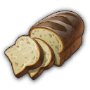

# Production Works

## Agriculture Works

<!-- List of Changes-->

List of Changes

- 
<!-- Some items for agriculture will be adapted. -->
  
Some items for agriculture will be adapted.

  - 
<!-- Old world plant specialists -->
    
Old world plant specialists

    - Cosmo Castelli, pioneer of agricultural science:
      - Has a new icon.
      - Only increases productivity by +50%.
      - Increases the required labour force by +50%.
      - Reduces the required number of modules by -25%.
      - Provides potato fertility.

    - Yvonne the Freedwoman:
      - Increases the required labour by +30%.
      - Reduces the required number of modules by -15%.
      - Provides grape fertility.
      - Affects all Old World crop farms.

    - Experienced planter:
      - Only increases productivity by +30%.
      - Increases the required labour force by +20%.
      - Reduces the required number of modules by -10%.
      - Provides hop fertility.
      - Affects all Old World crop farms.

    - Vegetable Farmer:
      - Increases productivity by +20%.
      - Increases the required labour force by +10%.
      - Reduces the required number of modules by -5%.
      - Provides pepper fertility.
      - Affects all Old World crop farms.

    - Cultivator:
      - Provides grain fertility.
      - Affects all useful plant farms in the Old World.

    - The following items will be removed:
      - Alexander Hancock, Father of the Potato.
      - Award-winning producer.
      - Sunny Settler.
      - Vintner.
      - Farmer.
      - Winemaker.
      - Arable farmer.
    

  - 
<!-- New World Plant Specialists -->
    
New World Plant Specialists

    - Dr Ali Al-Zahir, Botanical Director:
      - Increases productivity by +50% only.
      - Increases the required labour force by +50%.
      - Reduces the required number of modules by -25%.
      - Provides tobacco fertility.

    - Mrs Brown the farmer:
      - Increases the required labour by +30%.
      - Reduces the required number of modules by -15%.
      - Provides cotton fertility.
      - Affects all the New World's crop farms.

    - Soil Scientist:
      - Only increases productivity by +30%.
      - Increases the required labour force by +20%.
      - Reduces the required number of modules by -10%.
      - Provides cocoa fertility.
      - Affects all the New World's crop farms.

    - Farmer:
      - Increases productivity by +20%.
      - Increases the required labour force by +10%.
      - Reduces the required number of modules by -5%.
      - Provides rubber fertility.
      - Affects all New World crop farms.

    - Harvester:
      - Provides corn fertility.
      - Affects all New World crop farms.

    - The following items are removed:
      - Horticulturist Hermann.
      - Arborist.
      - Tree Surgeon.
      - Picker.
    

  - 
<!-- Enbesa plant specialists -->
    
Enbesa plant specialists

    - Calla Lily from the blooming desert:
      - Increases productivity by +50%.
      - Increases the required labour force by +50%.
      - Reduces the required number of modules by -25%.

    - Yebeba's Robust Greenhouse:
      - Increases productivity by +40%.
      - Increases the required labour force by +30%.
      - Reduces the required number of modules by -15%.
      - Provides hibiscus fertility.

    - Mosquito net:
      - Increases productivity by +30%.
      - Increases the required labour force by +20%.
      - Reduces the required number of modules by -10%.
      - Provides spice fertility.

    - Birdhouse:
      - Increases productivity by +20%.
      - Increases the required labour force by +10%.
      - Reduces the required number of modules by -5%.
      - Provides teff fertility.
    

  - 
<!-- Animal specialists -->
    
Animal specialists

    - Mark van der Mark, breeder of shepherd dogs:
      - Increases productivity by only +50%.
      - Increases the required labour force by +50%.
      - Reduces the required number of modules by -25%.
      - Does not produce any additional alpaca wool.

    - Rodrigo the Ranchero:
      - Increases productivity by +40%.
      - Reduces maintenance costs by -40%.
      - Does not produce any additional beef.

    - Cattle farmer:
      - Increases productivity by +30%.
      - Reduces labour costs by -30%.

    - Herdsman:
      - Increases productivity by +20%.
      - Reduces the labour force by -20%.
    

  - 
<!-- Enbesa Animal specialists -->
    
Enbesa Animal specialists

    - Loving herdsman:
      - Increases productivity by +30%.
      - Reduces the required number of modules by -25%.
      - Also contributes to the goat farm.

    - Pasture Expert:
      - Increases productivity by +20%.
      - Reduces the labour force by -20%.
      - Does not produce any additional goat milk.
    

  - 
<!-- Agricultural machinery -->
    
Agricultural machinery

    - The golden harvester of the future:
      - Is now called = Advanced Harvester.
      - Increases productivity by +50%.
      - Increases maintenance costs by +50%.
      - No longer produces gold.

    - Patented steel seed drill:
      - Is now called = Steel Wonder Plough.
      - Reduces labour by -25%.

    - Tilting plough:
      - Reduces the labour by -15%.

    - Coulter plough:
      - Has a new icon.
      - Reduces the labour by -10%.
    

  - 
<!-- Veterinary medicine -->
    
Veterinary medicine

    - A remedy:
      - Is now Legendary.
      - Is now produced by Nate in the Arctic.
      - If already identified, it can be researched further.
      - Increases productivity by +50%.

    - Celestial Anthrax Vaccine:
      - Reduces maintenance costs by -25%.

    - Animal antibiotics:
      - Increases productivity by +35%.
      - Reduces maintenance costs by -15%.

    - Vitamin supplements:
      - Has a new icon.
      - Increases productivity by +25%.
      - Reduces maintenance costs by -10%.
    

  - 
<!-- Feeding places -->
    
Feeding places

    - Fabulous feeding place:
      - Increases productivity by +40%.
      - Increases maintenance costs by +25%.

    - Beautiful feeding place:
      - Increases productivity by +35%.
      - Increases maintenance costs by +15%.

    - Feeding area:
      - Increases productivity by +25%.
      - Increases maintenance costs by +10%.
    

  

## Biscuit Works

<!-- List of Changes-->

List of Changes

- ‘Biscuits’ are now made from flour + suet + eggs, + 1 of the following:
  - Citrus.
  - Cinnamon.
  - Jam.
  - Chocolate.

## Bread Works

<!-- List of Changes-->

List of Changes

- ‘Bread’ now requires ‘Salt’ to produce.
  - There is an alternative recipe that also uses olives.

- An industrial bakery is available (the same as in ‘Industrial Low Tier Production’, only slightly adapted).
  - The normal bakery can no longer benefit from electricity.
- An Industrial Mill is available (The same as in ‘Industrial Low Tier Production’, only slightly customised).
  - The normal mill can no longer benefit from electricity.

- Some items for bakeries will be customised.

  - Marie-Antoine, Patissier Royale:
    - Increases the input of flour by + 2/1.
    - Produces an additional 2/1 of the respective factory output.

  - Pâtissier Patrice:
    - Now additionally produces biscuits 1/5.

  - Cake artist:
    - Reduces the labour force by -30%.
    - No longer produces chocolate.

  - Baker:
    - No longer exchanges flour for wheat.
    - Increases productivity by +10%.
    - Reduces required labour by -10%.
    - Reduces maintenance costs by -10%.

## Brick Works

<!-- List of Changes-->

List of Changes

- An industrial brickworks is available (the same as in ‘Industrial Low Tier Production’, only slightly adapted).
  - The normal brickworks can no longer benefit from electricity.

- The brickworks now needs coal to fire the bricks.
  - The Industrial Brickworks, on the other hand, needs electricity instead of coal.

- The concrete factory also needs ‘quartz sand’ for the reinforced concrete.

- A coal mine is provided as an early source of coal.
- A clay mine is provided as a late clay source.

- Some items for the brickworks/concrete works are adapted.

  - Francois Thorne, magnate of the construction industry:
    - Now produces 5/1 of the respective factory outputs instead of wood veneer.
    - Labour is no longer exchanged.
    - Now also affects Brickworks and Concrete Plants in the New World.

  - Gerhard the Architect:
    - Additionally reduces maintenance costs by -40%.
    - No more electricity is provided.

  - Foreman:
    - Additionally reduces labour by -30%.
    - Increases productivity by +30%.
    - No additional steel beams are produced.

## Cable Works

<!-- List of Changes-->

List of Changes

- ‘Power cables’ can now be produced in the Old World.
- ‘Power cables’ have been added as a construction cost for some buildings.
- ‘Power cables’ are now required when crafting telephones, lifts and some of Nate's items.

- Some items for Light Bulb Factory / Phonograph Factory / Telephone Factory / Fan Factory will be adjusted.

  - Telephone and phonograph factories no longer count as carpentry workshops.

  - Prof Ram Devi, Head of Electricity:
    - Now generates 5/1 power cables instead of his previous additional one.
    - Now includes ‘Telephone Factory’ instead of ‘Chemical Factory: Film Reels’.

  - Johan the Inventor:
    - Now influences the same factories as Devi.
    - No longer exchanges wood veneer for planks.
    - Increases the input of glass / wood veneer / aluminium profiles by + 1/1 (input depends on the influenced factory)
    - Produces 1/1 of the respective factory output additionally.

  - Science genius:
    - Now influences the same factories as Devi.
    - Increases productivity by +30%.
    - No additional filaments are produced.
    - No more labour is exchanged.

  - Physicist:
    - Now influences the same factories as Devi.

  - Electrician:
    - You now influence the same factories as Devi.

## Cheese Works

<!-- List of Changes-->

List of Changes

- ‘Cheese’ now requires ‘Salt’ for production.
  - There is an alternative recipe that uses additional herbs.

- An Industrial Dairy is available (The same as from ‘Industrial Low Tier Production’, only slightly adapted).
- An industrial cheese dairy is available (the same as in ‘Industrial Low Tier Production’, only slightly adapted).
  - The normal cheese dairy can no longer benefit from electricity

- When the mod **Milk from Cattle Farm (Lion053)** is active:
  - The New World Cattle Farm now produces milk without electricity, even if the ‘Rise of the New World’ DLC is active

- Some items for cheese dairies will be adjusted.

  - The thermometer items now affect the cheese dairies.

  - ‘Kitchen assistant’ became ‘Cheese master Manuela’
    - She increases the input of milk by + 2/1.
    - She produces an additional +2/1 cheese.

## Chemical Works

<!-- List of Changes-->

List of Changes

- ‘Paints and colours’ now require resin + ethanol + pigments for production.
  - Pigments are now produced directly in the ore mine (ores are no longer required in the game).
  - The ‘Laboratory: Pigments’ has now become ‘Chemical Factory: Paints and Colours’.
    - It requires rubber + ethanol + pigments.

- The ‘Laboratory: Fire Extinguisher’ has now become ‘Arsenal: Fire Extinguisher’.

- ‘Lemonade’ is now produced without ‘Saltpetre’.

- ‘Souvenirs’ now require ‘Celluloid’ instead of ‘Cotton’ and ‘Camphor’.

- ‘Typewriters’ now also require ‘Celluloid’.

- ‘Toys’ now also require ‘Celluloid’.

- ‘Billiard tables’ now additionally require ‘varnish and colours’.

- ‘Electric motors’ are now produced without ‘celluloid’.

- ‘Fans’ now also require ‘Celluloid’.

- ‘Scooters’ now also require ‘Aluminium profiles’.

- The ‘Mineralogist’ item now also produces ‘Pigments’.

- The production quantity ratios have been adjusted.

- Some items for chemical factories / production lines / manufactories will be adjusted.

  - Get rich quicker, Volume VIII: Get rid of the sand in the gears!
    - Is now called = Operating instructions: Optimised processes.
    - Affects all chemical plants/production lines/manufactories
    - Increases productivity by +50%.
    - Reduces labour by -25%.
    - Reduces maintenance costs by -25%.

  - Double redundancy:
    - Is now called = operating instruction: failover.
    - Affects all chemical plants/production lines/manufactories
    - Increases productivity by +40%.
    - Increases maintenance costs by +40%.
    - Increases the probability of fire by +40%.

  - Get rich quicker, Volume IV: Night operation:
    - Now means = operating instructions: night shift.
    - Affects all chemical plants/production lines/manufactories
    - Increases productivity by +30%.
    - Increases the labour force by +30%.
    - Increases the probability of rebellion by +30%.

  - Re-merge:
    - Influences All Chemical Factories
    - Increases productivity by +40%.
    - Increases the labour force by +20%.
    - Increases maintenance costs by +20%.
    - Produces an additional 1/4 of the respective factory output.

  - The following items will be removed:
    - Get Rich Quicker, Volume VII: Machine Men
    - Get Rich Quicker, Volume IV: No Crap
    - Get rich quicker, Volume IX: Performance pays off

## Chocolate Works

<!-- List of Changes-->

List of Changes

- Investors now need ‘pralines’ instead of ‘chocolate’
  - ‘Chocolates’ are made from ‘Chocolate’ + ‘Jam’ + ‘Honeycomb’ (formerly ‘Beeswax’) + ‘Rum’.

- ‘Atole’ now also requires ‘Cinnamon’ + ‘Chocolate’

- Some items for Chocolate Factory / Ice Cream Factory / Atole Factory will be adjusted.

  - Telephone and Phonograph factories no longer count as carpentry workshops.

  - Gennaro Garibaldi, Her Majesty's Chocolatier:
    - Now affects Chocolate Manufactory.
    - Now influences Atole Factory.
    - No longer influences Kitchen.
    - Increases the input of cocoa / chocolate by + 1/1 (input depends on the influenced factory)
    - Produces 1/1 of the respective factory output additionally.

  - Charlotte the chocoholic:
    - Now influences chocolate factory.
    - Now influences Atole factory.
    - No longer affects Kitchen.
    - Also reduces maintenance costs by -40%.

  - Quality Chocolatier:
    - Now affects Ice Cream Factory.
    - Now affects Chocolate Factory.
    - Now affects Atole Factory.
    - Additionally reduces maintenance costs by -30%.
    - Additionally increases productivity by +30%
    - No longer exchanges inputs.
    - No longer produces additional goods.

## Cloth Works

<!-- List of Changes-->

List of Changes

- New product ‘woollen fabric’, is made from wool/alpaca wool.
  - ‘Wool fabric’ is now required for the manufacture of various products.
    - Work clothes.
    - Suits (Mod).
    - Uniforms (Mod).
    - Toys.
    - Ponchos

- New product ‘Sewing thread’, made from flax/alpaca wool.
  - ‘Sewing thread’ is now necessary for the production of various products.
    - Work clothes.
    - Sails.
    - Suits (Mod).
    - Uniforms (mod).
    - Fur coats.
    - Leather boots.
    - Tailored suits.
    - Toys.
    - Ponchos.
    - Melons.
    - Costumes.
    - Footballs.
    - Robes.
    - Carpets.
    - Chronicles.

- Sails are now made from linen.
  - Linen is made from hemp in the Old World (Jacob's linen weaving mill is adapted)

- The needs of the population are adapted.
  - Farmers need wool instead of work clothes.
  - Craftsmen need work clothes instead of fur coats.
  - Fur coats are now a quality of life need for craftsmen.
  - Melons are now a quality of life need for artisans.
  - Investors now also need fur coats.
  - Tailor-made suits are now a quality of life need for investors.
  - Artistas now need additional costumes.

- Some items for clothing will be customised.

  - Looms
    - Now only affects cloth producers, not cloth consumers.

  - Cristobal Taffeta, Czar of Fashion:
    - Now only creates ‘custom suits’ 1/5 extra.

  - Mariana the Master Stylist:
    - Now generates ‘work clothes’ 1/5.
    - When Jacob's ‘Suits’ are in play, they are generated in addition to ‘Workwear’.
      - Both then run at 1/10.

  - Modiste:
    - Wool cloth is swapped for cotton cloth.

  - Hatter:
    - +1 ‘Felt’ is consumed.
    - Produce +1 ‘Melons’.
    - No more felt is exchanged for wool.

  - Lady Jane Smythe, Queen of Haute Couture:
    - Now influences dressmaker's shop instead of costume shop.
    - Also influences embroidery.
    - Now only produces ‘Costumes’ 1/5 additionally.

  - Lily the Fashion Designer:
    - Increases productivity by +40%.
    - Now produces ponchos at 1/5.
    - Additionally affects embroidery.
    - Now only creates ‘Costumes’ 1/5 extra.
    - No longer reduces the required labour force.

  - Couturière:
    - Wool fabric is exchanged for linen.

  - Costume Maker:
    - Increases productivity by +30%.
    - Now produces cotton fabric 1/5.
    - Now also influences the tailoring business.
    - No longer exchanges cotton fabric for wool.

  - Franke the fashion guru:
    - Now exchanges ‘cotton fabric’ for ‘woollen fabric’.
    - Now swaps ‘skins’ for

## Coffee Works

<!-- List of Changes-->

List of Changes

- There are now 2 different types of coffee.
  - ‘Coffee (light roast)’ is roasted in the New World. It is consumed by the local population.
  - ‘Coffee (Dark Roast)’ is roasted in the Old World. It is consumed by the local and Arctic population.

- Coffee roasters now have a running time of 120 seconds. Every cycle, 4 tonnes of coffee beans/malt + 1 cotton cloth/wool = 4 tonnes of coffee.

- With **Coffee and Tobacco in Enbesa (Taludas)**, 4 tonnes of coffee beans +1 linen = 4 tonnes of coffee. However, the New World variety.
  - The elders now consume coffee as a luxury.

- Some items are adjusted for coffee.

  - Fernando de Faro, coffee lover:
    - Influenced houses give 5 influence.
    - Coffee gives +10 income, +10 happiness and +2 population.
    - Now reduces the consumption of coffee by 50%.
    - All changes are only active if Faro is unique.

  - Marco de la Mocha, sommelier of coffee:
    - Instead of 1/2 coffee beans, he now produces 1/1 of the respective roaster.

  - Cecilia the coffee engineer:
    - Now reduces the required labour by -20%.
    - She no longer produces additional chocolate.

  - Bean Grinder:
    - Now reduces the required maintenance cost by -30%.
    - No longer replaces labour.

  - Cola Mola Wola machine:
    - Now produces 1/5 lemonade instead of coffee.

## Drink Works 1

<!-- List of Changes-->

List of Changes

- Eine Industrielle Schnapsbrennerei ist verfügbar (Die selbe wie aus "Industrial Low Tier Production", nur etwas angepasst).
  - Die normale Schnapsbrennerei kann nicht mehr von Strom profitieren.
- Eine Industrielle Bierbrauerei ist verfügbar (Die selbe wie aus "Industrial Low Tier Production", nur etwas angepasst).
  - Die normale Bierbrauerei kann nicht mehr von Strom profitieren.

- Schnapps und Beer brauchen jetzt Lehm **ODER** Glas zu herstellung.
  - Für die Schnappsproduktion der Bauern ist eine Lehmsenke hinzugefügt worden. Sie wird auf ein Lehmvorkommen gesetzt und kann ab Arbeiter zu einer Lehmgrube ausgebaut werden.
  - Glas wird wie gehabt erst ab Handwerkern freigeschaltet, bis dahin muss Lehm verwendet werden.
  - Für die neue Welt gibt es Rezepte mit Glas wenn **Jakobs New World Cities** aktiv ist.

- Schnapps in der neuen Welt wird jetzt aus Bananen anstatt Kartoffeln gemacht.
- Bier in der neuen Welt braucht jetzt Kräuter anstatt Getrtreide.

- Mezcal ist gegen Likör ausgetauscht worden.
  - Likör wird aus Schnaps + Zucker + Zitrusfrüchte hergestellt.

- Bier wird jetzt auch von Ingineuren und Investoren als Luxus verbraucht.
  - Der Verbrauch bei Arbeitern und Handwerkern wurde reduziert.

- Es werden einige Items für Schnaps und Bier angepasst.

  - Braukessel:
    - Episch gibt nur noch + 40% Produktivität.
    - Selten gibt nur noch + 35% Produktivität.
    - Ungewöhnlich gibt nur noch + 25% Produktivität.

  - Bruder Hilarius, Meister der Braukunst:
    - Beinflusst keine Schnapsbrennereien mehr.
    - Steigert den Verbrauch von Hopfen und Kräuter um +2/1.
    - Erzeugt 2/1 Bier zusätzlich.
    - Erzeugt kein Rum mehr.

  - Braumeister Bill:
    - Beinflusst keine Schnapsbrennereien mehr.
    - Reduziert keine Aufstandgefahr mehr.
    - Liefert keine Elektrizität mehr.
    - Steigert die Produktivität um +40%.
    - Erzeugt jetzt Rum 1/5

  - Preisgekrönter Brauer:
    - Steigert die Produktivität um +30%.

  - Sir Lewis Brindley, Chemiker mit Verstand:
    - Steigert den Verbrauch von Kartoffeln, Bananen und Schnaps um +2/1.
    - Erzeugt 2/1 Schnapps/Likör mehr.

  - Destillateur:
    - Ist jetzt Episch.
    - Beinflusst keine Brauerei mehr.
    - Erhöht die Produktivität um +40%.
    - Erzeugt jetzt 1/5 Ethanol.

  - Schwarzbrennerin:
    - Ist jetzt Selten.
    - Beinflusst nur noch Schnapsbrennereien und Likörfabrik.
    - Reduziert die Arbeitskraft um -30%.

  - Enbesanischer Gesandter:
    - Beinflusst Hacienda Bierbrauereien anstatt Mezcal-Ausschank.

## Drink Works 2

<!-- List of Changes-->

List of Changes

- Rum, Sekt und Cognac benötigen jetzt Fässer zu herstellung.
- Küfereien sind für die Alte und Neue Welt hinzugefügt worden.
  - Fässer werden aus Bretter + Stahl hergestellt.
    - Man kann alternativ auch Kirschholzbretter oder Wanzabretter verwenden und bekommt damit mehr pro Zyklus an Fässern.

- Rum wird jetzt auch von Investoren als Luxus verbraucht.
  - Der Verbrauch bei Handwerkern und Ingineuren wurde reduziert.

- Cognac hat ein neues Icon erhalten.

- Es werden einige Items für Sekt / Rum / Cognac angepasst.

  - Braukessel:
    - Beinflussen jetzt auch Cognac Manufaktur

  - Mme. Elise „die Nase“ Bouquet:
    - Steigert den Verbrauch von Trauben/Zuckerrohr/Kartoffeln um +2/1.
    - Erzeugt 2/1 des jeweiligen Fabrik outputs zusätzlich.

  - Sommelier Raymond:
    - Erzeugt jetzt Mezcal 1/5.

  - Angesehene Önologin:
    - Steigert die Produktivität um +30%.
    - Reduziert die Arbeitskräfte  um -30%.

## Fertiliser Works

<!-- List of Changes-->

List of Changes

- "Dünger" benötigt jetzt zusätzlich "Pottasche" zur herstellung.
  - Potasche wird aus Holz in einem Aschehaus hergestellt.

- Es werden einige Dünger Items angepasst.

  - Der „Bauerntölpel“-​ Zigarrenroller:
    - Heißt jetzt = Superphosphat-​Dünger.
    - Hat ein neues Icon.
    - Steigert die Produktivität um +100%.
    - Steigert die benötigten Module um +50%.
    - Erzeugt keine Zigarren mehr.

  - Superphosphat-​Dünger:
    - Heißt jetzt = Kunstdünger.
    - Hat ein neues Icon.

  - Kunstdünger:
    - Heißt jetzt = Holzasche.
    - Hat ein neues Icon.

  - Holzasche:
    - Heißt jetzt = Einfacher Dünger.
    - Hat ein neues Icon.

## Forestry Works

<!-- List of Changes-->

List of Changes

- "Rentierfleisch" heißt jetzt = "Wildfleisch"
- "Bärenfelle" heißen jetzt = "Exotische Felle"

- Alle Forstbetriebe benötigen jetzt 80% ihres Radius als freie fläche um mit 100% zu produzieren.
  - Das kann in bestehnden Spielständen bei Jagdhütten und Köhlereien zu einem abfall ihrer Produktion führen!

- 
<!-- Es werden einige Item für die Forstwirtschafft angepasst. -->
  
Es werden einige Item für die Forstwirtschafft angepasst.

  - 
<!-- Holzfäller / Köhler Items -->
    
Holzfäller / Köhler Items

    - Ursula Green, Hüterin der Wälder:
      - Reduziert keine Waldflächte mehr.
      - Beinflusst keine Jagdhütte mehr.
      - Erzeugt 1/5 Harz.

    - Miss Rodriguez die Naturschützerin:
      - Reduziert die Arbeitskräfte  um -40%.
      - Erzeugt keine Baumwolle mehr.

    - Parkhüter:
      - Beinflusst jetzt zusätzlich alle Holzfällerhütten.
      - erzeugt 1/5 Felle anstelle von Kautschuck.

    - Sägen
      - Vincent-​Sägemaschine:
        - Erhöht die Produktivität um +40%.
        - Reduziert die benötigte Waldfläche um -25%
        - Beinflusst jetzt zusätzlich alle Köhlereien.

      - Zwei-​Mann-​Säge:
        - Reduziert die benötigte Waldfläche um -15%
        - Beinflusst jetzt zusätzlich alle Köhlereien.

      - Bogensäge:
        - Reduziert die benötigte Waldfläche um -10%
        - Beinflusst jetzt zusätzlich alle Köhlereien.
    

  - 
<!-- Jaghütten Items -->
    
Jaghütten Items

    - Steen, der wilde Grenzer:
      - Ist jetzt Legendär.
      - Steigert die Produktivität um +50%.
      - Erzeugt 1/5 Wildfleisch anstelle von Rindfleisch.

    - Erfahrene Jägerin:
      - Ist jetzt Episch
      - Steigert die Produktivität um +40%.
      - Reduziert die Arbeitskräfte  um -40%
      - Erzeugt keine Wolle mehr.

    - Fallensteller:
      - Ist jetzt Selten
      - Steigert die Produktivität um +30%.
      - Erzeugt jetzt 1/5 Wolle zusätzlich.

    - Wilderer:
      - Ist jetzt Ungewöhnlich
      - Steigert die Produktivität um +20%.

    - Elinor die Rehschubserin:
      - Beinflusst nur noch die Jaguar-Jagdhütte (Benötigt die mod "Mayabeque")
      - Erzeugt jetzt 1/1 Felle zusätzlich.

    - Fallen:
      - Marderverstümmler:
        - Reduziert die benötigte Waldfläche um -25%
        - Reduziert keine benötigtern Arbeitskräfte mehr.

      - Fangeisen:
        - Reduziert die benötigte Waldfläche um -15%
        - Reduziert keine benötigtern Arbeitskräfte mehr.

      - Falle:
        - Reduziert die benötigte Waldfläche um -10%
    

  - 
<!-- Baumschulen Items -->
    
Baumschulen Items

    - Bestäubungsmethode:
      - Steigert die Produktivität um +50%.
      - Steigert die Arbeitskräfte  um +50%.
      - Reduziert keine Waldfläche mehr.

    - Artenübergreifende Transplantation:
      - Steigert die Produktivität um +40%.
      - Reduziert die Wartunskosten um -40%.
      - Reduziert keine Waldfläche mehr.

    - Optimierter Baumschnitt:
      - Steigert die Produktivität um +30%.
      - Reduziert die Arbeitskräfte  um -30%.
      - Reduziert keine Waldfläche mehr.

    - Folgende Items werden entfernt:
      - Schneller reich werden, Band I: Kein Schaden für den Profit
      - Schneller reich werden: Band II: Ist die Banane wirklich krum?
      - Schneller reich werden, Band III: Praktische Polykultur

    - Baumscheren:
      - Teutonisch-​technisches Schneidewerkzeug:
        - Reduziert die benötigte Waldfläche um -25%
        - Beeinflusst jetzt alle Baumschulen.

      - Druidensichel:
        - Steigert die Produktivität um +35%
        - Reduziert die benötigte Waldfläche um -15%
        - Beeinflusst jetzt alle Baumschulen.

      - Industrielle Hippe:
        - Steigert die Produktivität um +25%
        - Reduziert die benötigte Waldfläche um -10%
        - Beeinflusst jetzt alle Baumschulen.
    

  - 
<!-- Zoo / Museum Buffs -->
    
Zoo / Museum Buffs.

    - Park: Miombo-Wälder:
      - Beinflusst nur noch alle Holzällerhütten und alle Köhlereien.

    - Park: Regenwald:
      - Beinflusst nur noch alle Holzällerhütten und alle Köhlereien.
      - Reduziert die benötigte Waldfläche um -10%.

    - Ausstellung: Ursprung der Menschheit:
      - Beinflusst nur noch alle Fischreien, alle Jagdhütten und alle Baumschulen.
      - Reduziert die benötigte Waldfläche um -10%.

    - Ausstellung: Bronzezeit:
      - Beinflusst nur noch alle Steinbrüche und alle Baumschulen.
      - Reduziert die benötigte Waldfläche um -10%.
      

  

## Glas Works

<!-- List of Changes-->

List of Changes

- "Glas" benötigt jetzt zusätzlich "Pottasche" und "Kohle".
  - Potasche wird aus Holz in einem Aschehaus hergestellt.

- Eine Fortschrittliche Glashütte ist verfügbar (Die selbe wie aus "Industrial Low Tier Production", nur etwas angepasst).
- Die Fortschrittliche Glashütte benötigt "Soda" anstelle von "Pottasche"
  - Soda wird aus Salz, Schwefel, Kohle und Kalk hergestellt.
    - Schwefel ist ein neues Produkt das mit Schwefelröster die man neben minen baut gewonnen werden kann.
    - Kalk ist eine namensänderung vom Zement.
      - Kalk wird jetzt als Nebenprodukt bei der Perlenzucht erzeugt.
    - Salz kann jetzt in der alten Welt gewonnen werden.
- Die Fortschrittliche Glashütte benötigt Strom anstelle von Kohle

- Shampo, Limonade und Parfüm benötigen jetzt zusätzlich Glas für die herstellung.

- Glühbirnen sind jetzt ein bedürfnis der Lebensqualität für Reihenhäuser der Arbeiter und Handwerker (Mod gebäude von jakob).
- Brillen sind jetzt ein bedürfnis der Lebensqualität für Handwerker.

- Es werden einige Items für Brillen / Glas angepasst.

  - Verbrennungschemiker:
    - Beinflussen jetzt auch Glashütten.

  - Glasbläser Items:
    - Beinflussen jetzt keine Glashütten mehr.

  - Gerhard Fuchs, vom patentierten Augenglas:
    - Stellt keine Taschenuhren mehr zusätzlich her.
    - Tauscht jetzt Messing gegen Holzfunier.

  - Optometrist Otto:
    - Stellt kein Glas mehr zusätzlich her.
    - Reduziert die Arbeitskräfte  um -40%.

## Goulash Works

<!-- List of Changes-->

List of Changes

- "Gulasch" benötigt jetzt zusätzlich "Kartoffeln" und "Kräuter" zur Produktion.
- "Sardinen" (Mod Produkt von Jakob) benötigen jetzt zusätzlich "Kräuter" zur Produktion.
- "Meeresfrüchteeintopf" aus der Alten welt (Mod von Jakob) benötigt jetzt zusätzlich "Kräuter" zur Produktion.
  - Kräuter können jetzt in der Alten Welt angebaut werden.

- Eine Industrielle Rinderzucht ist verfügbar (Die selbe wie aus "Industrial Low Tier Production", nur etwas angepasst).
- Die Rinderfarm hat jetzt eine Laufzeit von 60 sekunden.

- Fleischkonserven sind ein ein bedürfnis der Lebensqualität von Arbeitern.
- Investoren verbrauchen jetzt Gulasch.

- Es werden einige Items für Gulasch/Fleischkonserven angepasst.

  - Marcel Forcas, Koch für Berühmtheiten:
    - Steigert die Produktivität nur noch um +50%.
    - Beinflusst zusätzlich die Küche für Meeresfrüchteeintopf der Alten welt (Mod von Jakob)
      - Tauscht Calamares gegen Fisch.
      - Erzeugt keine Würste mehr zusätzlich.

  - Rezeptarchivarin:
    - Tauscht jetzt Rindfleisch gegen Rentierfleisch.
    - Erzeugt zuzsätzlich 1/4 Pemmikan.

  - Mrs. Mayson, Koryphäe der Hauswirtschaft:
    - Tauscht jetzt Eisen gegen Glas.
    - Erzeugt zuzsätzlich 1/5 Fleischkonserven

  - Michel der Sternekoch:
    - Steigert die Produktivität um +40%.
    - Tauscht Gulasch gegen Meeresfrüchteeintopf.
    - Erzeugt zusätzlich 1/2 Fleischkonserven
    - Beinflusst zusätzlich die Fischdosenfabrik (Mod von Jakob)
      - Tauscht Fisch gegen Calamares.

## Helium Works

<!-- List of Changes-->

List of Changes

- Helium-Extraktoren werden jetzt auf Öl-Quellen errichtet und nicht mehr auf auf Minenplätzen.
  - Bestehende Extraktoren laufen auf Minenplätzen weiter, aber neue Extraktoren passen nur auf Öl-Quellen.
  - Helium- Extraktoren benötigen keinen Lehm mer.

- Kühlschränke verwenden Helium anstelle von Arktis-Gas.
- Feuerläöscher brauchen jetzt zusätzlich Helium.

## Jewelry Works

<!-- List of Changes-->

List of Changes

- Holzschmuck wird als Luxus Bedürfnis für Bauern, Arbeitern und Handwerkern hinzugefügt.
  - Holzschmuck wird aus Holz hergestellt

- Schmuck wird als Lxusu Bedürfnis für Ingineure hinzugefügt.
  - Die Produktionskette für Schmuck wird von Investoren nach Ingineuren verschoben.

- Es werden einige Items für Holzschmuck/Schmuck angepasst.

  - Glasbläser:
    - Beeinflusst jetzt alle Schmuckwerkstätten (Holzschmuck).
    - Steigert die Produktivität um +40%.
    - Steigert die Wartunsksoten um +25%.
    - Es werden Handwerker als Arbeitskräfte benötigt.
    - Es wird zusätzlich 1/1 Glas verbraucht.
    - Es wird zusätzlich 1/1 Holzschmuck erzeugt.

  - François Strindberg, Juwelier der Krone:
    - Reduziert die Perlen nicht mehr auf 0/1.
    - Stellt Taschenuhren nur noch 1/5 her.
    - Steigert die Wartungskostem um +25%.
    - Steigert die Arbeitskräfte  um +25%.

  - Goldschmied Gilbert:
    - Heißt jetzt = Illustrer Gemmologe.
    - Steigert die Produktivität um +40%.
    - Steigert den verbrauch von Perlen um 1/1.
    - Erzeugt zusätzlich 1/1 Schmuck
    - Tauscht keine Golbarren gegen Golderz mehr.

  - Illustrer Gemmologe:
    - Heißt jetzt = Goldschmied Gilbert.
    - Steigert die Produktivität um +30%.
    - Reduziert die Arbeitskräfte  um -30%.
    - Tauscht keine Golbarren gegen Golderz mehr.

## Metal Works

<!-- List of Changes-->

List of Changes

- Ein Fortschrittliches Stahlwerk ist verfügbar (Das selbe wie aus "Industrial Low Tier Production", nur etwas angepasst).
  - Das normale Stahlwerk nicht mehr von Strom profitieren.

- Ein Fortschrittlicher Hochofen ist verfügbar (Der selbe wie aus "Industrial Low Tier Production", nur etwas angepasst).
  - Der normale Hochofen nicht mehr von Strom profitieren.

- Das Stahlwerk braucht jetzt Kohle um Stahlträger zu formen.
  - Das Fortschrittliche Stahlwerk braucht hingegen Strom anstatt Kohle.

- Die Konservenfabrik braucht jetzt Stahl anstelle von Eisen für die Produktion.

- Die Glühbirnenfabrik braucht jetzt zusätzlich Stahl für die Produktion.

- Die Telefonfabrik braucht jetzt zusätzlich Stahl für die Produktion.

- Die Messinghütte braucht jetzt zusätzlich Kohle für die Produktion.

- Die Aluminiumhütte braucht jetzt Strom anstelle von Kohle für die Produktion.

- "Motoren" heißen jetzt "Elektromotoren"
- "Dampfmaschienen" heißen jetzt "Motoren"

- Es werden einige Items für Die Metallindustrie angepasst.

  - Bruno Ironbright, Ingenieurstitan:
    - Stell Strom zur verfügung.
    - Stellt nur noch 1/5 des jeweiligen Fabrik outputs zusätzlich her.
    - Beeinflusst keine Ventilatorenfabrik mehr.
    - Beinflusst alle Motorenfabriken.

  - Dario der Maschinenbauer:
    - Steigert die Produktivität um +40%.
    - Reduziert die Arbeitskräfte  um -20%.
    - Stellt jetzt 1/5 Motoren zusätzlich her.
    - Tauscht kein Stahl gegen Eisenerz mehr aus.

  - Susannah die Dampfingenieurin:
    - Heißt jetzt = Susannah die Ingenieurin.
    - Steigert die Produktivität um +40%.
    - Reduziert die Arbeitskräfte  um -40%.
    - Beeinflusst jetzt zusätzlich die Motrorollerfabrik.
    - Beeinflusst jetzt alle Motorenfabriken.
    - Tauscht keine Dampfmaschinen gegen Glühfäden mehr.
    - Stellt keine Glühbirnen mehr zusätzlich her.

  - Dampfingenieur:
    - Heißt jetzt = Ingenieur.
    - Steigert die Produktivität um +30%.
    - Reduziert die Wartungskosten um -30%.
    - Beeinflusst jetzt zusätzlich die Motrorollerfabrik.
    - Beeinflusst jetzt alle Motorenfabriken.
    - Stellt keine Hochräder mehr zusätzlich her.

  - Maschinist:
    - Beeinflusst jetzt zusätzlich die Motrorollerfabrik.
    - Beeinflusst jetzt alle Motorenfabriken.

  - Verbrennungschemiker:
    - Beeinflusst jetzt alle Schmelzhütten.
    - Steigert nicht länger die Produktivität.

  - Schmelztiegel:
    - Beeinflusst jetzt alle Schmelzhütten.

  - Henri Zanchi, Mann des Stahls:
    - Beeinflusst jetzt zusätzlich alle Schmelzhütten.
    - Reduziert nicht länger die Wartungskosten.
    - Reduziert nicht länger die Arbeitskräfte.

  - Meisterin der Schmieden:
    - Beeinflusst jetzt zusätzlich alle Schmelzhütten.
    - Reduziert die Arbeitskräfte  um -40%.

  - Stahläugiger Stahlschmied:
    - Beeinflusst jetzt zusätzlich alle Schmelzhütten.
    - Reduziert nicht länger die Wartungskosten.

## Mining Works

<!-- List of Changes-->

List of Changes

- Dynamitlager sind verfügbar. Zu finden sind die im "Materialien" Tab (Bei Brettern, Ziegelsteinen, Fenster, etc)
  - Dynamitlager können neben Minen und Gruben platziert werden.
  - Dynamitlager verbrauchen Dynamit und lassen Minen und Gruben in der nähe mehr Rohstoffe erzeugen.

- "Quarzgruben" heißen jetzt "Sandwerk".

- 
<!-- Es werden einige Items für den Bergbau angepasst. -->
  
Es werden einige Items für den Bergbau angepasst.

  - Berbauaufzüge
    - Beeinflussen zusätzlich alle Arktischen Minen.

  - Sprengstoff Items
    - Beeinflussen zusätzlich alle Arktischen Minen.

  - Bohr-Maschinen
    - Beeinflussen nicht länger die Bauxitmine.
    - Beeinflussen nicht länger die Zementmine.

  - Unverwüstliche Gaspumpe
    - Steigert die Produktivität um +50%.
    - Reduziert die Explosionswahrscheinlichkeit um -25%.
    - Stellt jetzt zusätzlich nur noch Helium 1/5 her.

  - 
<!-- Exkavatoren -->
    
Exkavatoren

    - Erzexkavator:
      - Stellt zusätzlich 1/4 Kohle her.
      - Stellt zusätzlich 1/4 Eisen her.
      - Stellt zusätzlich 1/4 Sand her.

    - Extra-​Erzexkavator:
      - Stellt zusätzlich 1/4 Kupfer her.
      - Stellt zusätzlich 1/4 Zink her.
      - Stellt zusätzlich 1/4 Zement her.

    - Ertragreicher Erzengel:
      - Stellt zusätzlich 1/4 Bauxit her.
      - Stellt zusätzlich 1/4 Erze her.

    - Alle Exkavatoren:
      - Sind keine Verbrauchs-Items mehr.
      - Beeinflussen zusätzlich alle Tagebaugruben.
      - Beeinflussen zusätzlich alle Arktischen Minen.
      - Steigern nicht länger die Produktivität.
      - Können nicht mit anderen Exkavatoren in einer Handelskammer genutzt werden.
    

  - 
<!-- Geologische Spezialisten -->
    
Geologische Spezialisten

    - Steven MacLeod, geologischer Landvermesser:
      - Stellt nur noch Kupfer und Zink 1/5 zusätzlich her.
      - Steigert die Arbeitskräfte  um +25%.
      - Steigert die Wartungskosten um +25%.
      - Beinflusst keine Salpeterwerke mehr.
      - Beinflusst keine Sandwerke mehr.

    - Grigor der Geologe:
      - Stellt keinen Strom mehr bereit.
      - Steigert die Produktivität um +40%.
      - Stellt zusätzlich Zement und Sand 1/5 her.
      - Steigert die Arbeitskräfte  um +20%.
      - Steigert die Wartungskosten um +20%.
      - Beinflusst keine Salpeterwerke mehr.
      - Beinflusst keine Sandwerke mehr.

    - Steinbruchmeister:
      - Stellt zusätzlich Eisen 1/5 her.
      - Steigert die Arbeitskräfte  um +15%.
      - Steigert die Wartungskosten um +15%.
      - Beinflusst keine Salpeterwerke mehr.
      - Beinflusst keine Sandwerke mehr.

    - Steinhauer:
      - Heißt jetzt = Linda MacLeod, Küstenvermesserin.
      - Ist Legendär.
      - Ist ein Hafemeisteri Item.
      - Steigert die Produktivität um +50%.
      - Stellt 1/5 Gänsefeder zusätzlich her.
      - Beinflusst Alle Salpeterwerke.
      - Beinflusst Alle Sandwerke.
      - Beinflusst Alle Salinen.

    - Bohrhauer:
      - Heißt jetzt = Küstenforscher.
      - Ist Episch.
      - Ist ein Hafemeisteri Item.
      - Steigert die Produktivität um +40%.
      - Reduziert die Arbeitskräfte  um -40%.
      - Beinflusst Alle Salpeterwerke.
      - Beinflusst Alle Sandwerke.
      - Beinflusst Alle Salinen.
    

  - 
<!-- Minen Spezialisten -->
    
Minen Spezialisten

    - Jörg von Malching, Augur des Aurum:
      - Stellt nur noch Golderz 1/30 her.
      - Steigert die Produktivität nur noch um +50%.

    - Micaela die Bergbauingenieurin:
      - Steigert die Produktivität um +40%.
      - Reduziert die Explosionswahrscheinlichkeit um -40%.
      - Reduziert die Brandwahrscheinlichkeit um -40%.
      - Reduziert keine Wartungskosten mehr.
      - Reduziert keine Arbeitskrfäte mehr.

    - Erstklassiger Sappeur:
      - Steigert die Produktivität nur noch um +30%.
      - Reduziert die Wartungskosten um -30%.
      - Reduziert die Arbeitskrfäte um -30%.
    

## New World Food Works

<!-- List of Changes-->

List of Changes

- Die Hacienda- Gewürzfarm hat eine laufzeit von 60 Sekunden.

- Die Hacienda- Chilisaucenfabrik benötigt zusätzlich Salz für die Produktion.
  - Eine Saline für die Neue Welt ist verfügbar.

- Die Tortilla-​Bäckerei benötigt zusätzlich Kräuter und Salz für die Produktion.
  - Wenn Taludas "Burrito Boom" aktiv ist, braucht die Guacamole Küche Kräuter und Salz, anstelle von der Tortilla-​Bäckerei.
  - Wenn Jakobs "New World Cities" aktiv ist, verwendet die Tortilla-​Bäckerei Mehl anstatt Mais/Tortilas.

- Die Küche (Gebackene Bananane) benötigt zusätzlich Salz für die Produktion.

- Die Jalea-Küche benötigt zusätzlich Palmöl für die Produktion.
  - Palmöl wird in einer Baumschule hergestellt.
  - Wenn Jakobs "New World Cities" aktiv ist, verwendet die Jalea-Küche Mehl anstatt Mais.

- Meeresfrüchte Eintopf kann jetzt in der Neuen Welt hergestellt werden.
  - Meeresfrüchte Eintopf wird aus Calamares, Kartoffeln, Kräuter und Chilisoße hergestellt.
  - Obreros und Artistas verbrauchen jetzt zusätzlich Meeresfrüchteeintopf.

- Es werden einige Items für die Lebensmittelindustrie der Neuen Welt angepasst.

  - Meisterkonditor:
    - Heißt jetzt = Icnoyotl Savor, Bananenkönigin.
    - Ist jetzt Legendär.
    - Steigert den Verbrauch von Bananen um 1/1.
    - Produziert 1/1 des jeweiligen Fabrik outputs zusätzlich.
    - Beeinflusst Küche (Gebackene Bananen).

  - Tlayolotl Savor, Maiskönig:
    - Steigert den Verbrauch von Mais um 1/1.
    - Produziert 1/1 des jeweiligen Fabrik outputs zusätzlich.
    - Tauscht keinen Mais mehr gegen Bananen aus.
    - Beeinflusst zusätzlich Jalea-Küche.
    - Beeinflusst zusätzlich Hacienda- Atole-Fabrik.

  - Kantyi von der Quinoa:
    - Steigert die Produktivität um +40%.
    - Beeinflusst zusätzlich Küche (Gebackene Bananen).
    - Beeinflusst zusätzlich Hacienda- Chilisaucenfabrik.
    - Tauscht keine Arbeitskräfte mehr aus.

  - Mole-​Meister:
    - Reduziert die Wartunskosten um -30%.
    - Beeinflusst zusätzlich Küche (Gebackene Bananen).
    - Beeinflusst zusätzlich Jalea-Küche.
    - Beeinflusst zusätzlich Hacienda- Chilisaucenfabrik.
    - Tauscht keine Rindfleisch gegen Fischöl aus.

  - Meister der Gewürze:
    - Ist jetzt Legendär
    - Steigert den Verbrauch von Gewürzen um 1/1.
    - Produziert 1/1 des jeweiligen Fabrik outputs zusätzlich.
    - Beeinflusst Teffmühle.
    - Beeinflusst Hacienda- Chilisaucenfabrik.

  - Aaden Issack, weltberühmter enbesanischer Spitzenkoch:
    - Steigert den Verbrauch von Hummer und Calamaes um 1/1.
    - Produziert 1/1 des jeweiligen Fabrik outputs zusätzlich.
    - Reduziert nicht länger die Wartungskosten.
    - Tauscht keinen Hummer gegen Sanga-Kühe.

## Paper Works

<!-- List of Changes-->

List of Changes

- Papiermühlen benötigen jetzt zusätzlich Schwefel für die Produktion.
  - Schwefel kann in Enbesa in Gruben abgebaut werden.

- Es werden einige Items für die Papierherstellung angepasst.

  - Wahenoor der Papiermühlen-Experte:
    - Steigert die Wartungskoste um +40%.
    - Steigert die Arbeitskräfte  um +40%.

## Potato Works

<!-- List of Changes-->

List of Changes

- Kartoffels werden jetzt von Bauern, Arbeiter und Handwerkern verbraucht.
- Kartoffeln werden jetzt zusätzlich für die Herstellung von Gulasch benötigt.

## Salpetre Works

<!-- List of Changes-->

List of Changes

- Die Alpakafarm erzeugt jetzt keinen Salpeter mehr wenn sie Strom erhält
  - Es gibt jetzt eine Salpetergrube in der neuen Welt.

- Kanonen benötigen jetzt zusätzlich Schießpulver zur Produktion.
  - Schießpulver wird aus Salpeter und Kohle hergestellt.
  - Eine Salpeterhütte wurde als früher Quelle von Salpeter eingefügt.
    - Sie verbraucht Dung, Kalk, Pottasche.
      - Potasche wird aus Holz in einem Aschehaus hergestellt.
      - Dung wird von Tierhöfen im umkreis der Salpeterhütte erzeugt.
      - Kalk ist eine umbennennung von Zement.

## Sausage Works

<!-- List of Changes-->

List of Changes

- "Wurst" benötigt jetzt "Salz" zur Produktion.
  - Es gibt ein alternatives Rezept das zusätzlich Kartoffeln verbraucht.

- Eine Industrielle Wurstfabrik ist verfügbar (Die selbe wie aus "Industrial Low Tier Production", nur etwas angepasst).
  - Die normale Wurstfabrik kann nicht mehr von Strom profitieren.
- Eine Industrielle Schweinezucht ist verfügbar (Die selbe wie aus "Industrial Low Tier Production", nur etwas angepasst).

- Es werden einige Items für Metzgereien angepasst.

  - Maxime Graves, Delicatesseur Extraordinaire:
    - Produziert jetzt 1/4 Gulasch zusätzlich.
    - Wenn "Cattle need to be butchered" aktiv ist, wird 1/2 Rindfleisch anstelle von Gulasch produziert.

  - Chantelle die Feinschmeckerin:
    - Produziert jetzt 1/5 Felle zusätzlich.
    - Wenn "Häute" im spiel vorhanden sind, werden diese Anstelle von Fellen produziert.

  - Fleischermeister:
    - Produziert 1/5 Talg.

## Soap Works

<!-- List of Changes-->

List of Changes

- "Soap" now also requires "Potash".
- An advanced boiling plant is available (the same as in "Industrial Low Tier Production", only slightly adapted).
- The advanced boiling plant requires "Soda" instead of "Potash"
  - Soda ash is made from salt, sulphur, coal and lime.
    - Sulphur is a new product that can be obtained from sulphur roasters that are built next to mines.
    - Lime is a name change from cement.
    - Salt can now be extracted in the old world.

- An advanced Wasenmeisterei is available (the same as in "Industrial Low Tier Production", only slightly adapted).
- An advanced pig farm is available (the same as in "Industrial Low Tier Production", only slightly customised).

- Some items for soap are customised.

  - Hervé Savonne, inventor of toothpaste:
    - Now produces an additional 1/5 lubricant.
    - Now also influences the perfume laboratory.
    - No longer reduces labour force.

  - Perfumer Prunella:
    - Increases productivity by +40%.
    - Now produces an additional 1/5 shampoo.
    - Reduces Negative Attractiveness by -50%
    - Now also influences the Perfume Lab.

  - Herbal Hygienist:
    - Reduces maintenance costs by -30%
    - Reduces the labour force by -30%
    - Now also affects the Perfume Laboratory.

## Sulphur Works

<!-- List of Changes-->

List of Changes

- Dynamit braucht zusätzlich Schwefel und Quartzsand zur produktion.
- Schießpulver braucht zusätzlich Schwefel zur produktion.

- Gummi wird als neues Produkt eingeführt
  - Gummi wird aus Kautschuk und SChwefel hergestellt.

- Fahrgestelle braucht jetzt Gummi anstelle von Kautschuk zur produktion.
- Hochräder brauchen jetzt Gummi anstelle von Kautschuk zur produktion.
- Feuerlöscher brauchen jetzt Gummi anstelle von Kautschuk zur produktion.
- Motorroller brauchen jetzt Gummi anstelle von Kautschuk zur produktion.
- Kühlschränke brauchen jetzt Gummi anstelle von Kautschuk zur produktion.

- Es werden einige Items für Schwefel angepasst.

  - Veredlerin:
    - Ist jetzt Selten.
    - Steigert die Produktivität um +30%.
    - Produziert jetzt 1/5 Schwefel zusätzlich.

  - Verbrennungschemiker:
    - Beinflusst jetzt zusätzlich alle Schwefelröster.

## Tanning Work

<!-- List of Changes-->

List of Changes

- Nanduleder wird zu Leder umbenannt.
  - Eine Gerberei benötigt Häute (Neues Produkt), Salz und Holz für Leder.
  - Eine Industrielle Gerberei benötigt Häute, Salpeter und Chrome (Neues Produkt) für Leder

- Häute werden in einer neuen Wasenmeisteri aus Schweinen hergestellt.
  - Es gibt alternative Rezepte die Kühe oder Sanga-Kühe verwenden.
  - Die Nandufarm erzeugt direkt Häute.

- Arbeitskleidung braucht jetzt zusätzlich Leder zur produktion.
- Lederstiefel brauchen jetzt Leder anstelle von Sanga-Kühen zur produktion.
- Aktentaschen brauchen jetzt Leder anstelle von Sanga-Kühen zur produktion.
- Sofas brauchen jetzt Leder anstelle von Sanga-Kühen zur produktion.

- Die bedürfnisse der Bewölkerung werden angepasst.
  - Lederstiefel sind jetzt ein bedürfnis der Lebensqualität für Investoren.

- Es werden einige Items für Leder angepasst.

  - Jauche/Gülle Items:
    - Jauchetank:
      - Steigert die Produktivität um +25%.
      - Steigert die Wartungskosten um +25%.

    - Jauchegrube:
      - Steigert die Produktivität um +35%.
      - Steigert die Wartungskosten um +35%.
      - Reduziert die negative Attraktivität um -35%.

    - Moderner Güllesilo:
      - Steigert die Produktivität um +40%.
      - Steigert die Wartungskosten um +40%.
      - Reduziert die negative Attraktivität um -40%.

    - Beeinflussen nicht länger Schweinefarmen.
    - Beeinflussen nicht länger Siedereien.
    - Beeinflussen nicht länger Metzgereien.

  - Schuster Items:
    - Schusterleisten:
      - Heißt jetzt = Ledermesser.
      - Reduziert die Wartungskosten um -10%.

    - Schnürlochmaschine:
      - Heißt jetzt = Lederstanzer.
      - Steigert die Produktivität um +35%.
      - Reduziert die Wartungskosten um -15%.

    - Sohlenhefter:
      - Heißt jetzt = Ledernähmaschine.
      - Reduziert die Wartungskosten um -25%.

    - Beeinflussen zusätzlich die Ballmanufaktur.

  - Gerber:
    - Steigert den Verbrauch von Häuten um +2/1.
    - Erzeugt 2/1 Leder zusätzlich.
    - Reduziert die negativer Attraktivität um -50%.
    - Beinflusst alle Gerbereien.

  - Bumm Brimmell, der erste Dandy:
    - Steigert die Produktivität um +50%.
    - Produziert 1/5 des jeweiligen Fabrik outputs zusätzlich.
    - Tauscht keine Sanga-Kühe gegen Schweine mehr aus.
    - Beinflusst jetzt zusätzlich die Ballmanufaktur.

  - Paul Poiret, provokanter Modedesigner:
    - Tauscht Leder gegen Filz.
    - Steigert den Verbrauch von Filz um 1/1.
    - Produziert  1/1 des jeweiligen Fabrik outputs zusätzlich.
    - Beinflusst jetzt zusätzlich den Schuster-
    - Beinflusst jetzt zusätzlich die Ballmanufaktur.
    - Beinflusst nicht länger das Schneidergeschäft.

  - Maßschneider:
    - Steigert die Produktivität um +30%.
    - Reduziert die Arbeitskräfte um -30%.

## Tobacco Works

<!-- List of Changes-->

List of Changes

- Die Tabakplantage hat jetzt eine Laufzeit von 60 sekunden.

- Die Zigarettenfabrik von "Military Attention" wird zu einem Rezeptgebäude abgeändert.
  - Ein Rezept benötigt Hopfen, ist langsam und Produziert wenig.
  - Ein Rezept benötigt Tabak, ist schneller und Produziert mehr.

- Es werden einige Items für Zigarren angepasst.

  - Victor Perfecto, Vater der Zigarren:
    - Steigert den Verbrauch von Tabak um +1/1.
    - Erzeugt 1/1 Zigarren zusätzlich.
    - Reduziert keine Wartungskosten mehr.

  - Torcedor Lucia:
    - Reduziert die Arbeitskräfte um -40%.
    - Tauscht kein Holzfurnier gegen Bretter mehr aus.

  - Zigarrenkenner:
    - Reduziert die Wartungskosten um -30%.
    - Reduziert keine Arbeitskräfte mehr.

## Tool Works

<!-- List of Changes-->

List of Changes

- Die bedürfnisse der Bewölkerung werden angepasst.
  - Werkzeuge sind jetzt ein bedürfnis der Lebensqualität für Bauern.
  - Arbeiter und Handwerker verbrauchen jetzt Werkzeug.

- Wenn "Tool Integration" aktiv ist verbrauchen folgende Betriebe zusätzlich Werkzeug
  - Fortschrittliche Sägewerke.
  - Fortschrittliche Ziegelei.
  - Fortschrittliche Mühle.
  - Fortschrittliche Wasenmeisterei.

## Watch Works

<!-- List of Changes-->

List of Changes

- Taschenuhren verbrauchen jetzt Messing anstatt Goldbarren.

- Die bedürfnisse der Bewölkerung werden angepasst.
  - Taschenuhren sind jetzt ein bedürfnis der Lebensqualität für Arbeiter und Handwerker.

- Es werden einige Items für Taschenuhren angepasst.

  - Hans Klein, der alte Großvater Zeit:
    - Steigert die Wartungskosten um +25%.
    - Steigert die Arbeitskräfte um +25%.
    - Tauscht die Arbeitskräfte gegen Handwerker.
    - Tauscht Messing gegen Goldbarren aus.
    - Erzeugt 1/5 Schmuck zusätzlich.

  - Chronometrikerin Chiara:
    - Steigert die Produktivität um +40%.
    - Tauscht keine Goldbarren gegen Messing mehr aus.
    - Reduziert die Arbeitskräfte um -40%.
    - Reduziert keine Wartungskosten mehr.

## Woodworking

<!-- List of Changes-->

List of Changes

- Anstelle von Holz verarbeiten viele Betriebe jetzt Bretter.
- Bretter wurden einigen Produktionen als zusätzlicher Verbauch hinzugefügt.

- "Holzfunrier" wurde zu "Furniertes Holz" umbenannt.
  - "Furniertes Holz" wird nun aus Holz und Brettern hergestellt.

- Es werden einige Items für Schreinereien angepasst.

  - Elias Papadikas, Dekorateur der Schaufenster:
    - Steigert den Verbrauch von Brettern, Kirschholzbrettern, Wanzabretter und Furniertem Holz um 1/1.
    - Produziert 1/1 des jeweiligen Fabrik outputs zusätzlich.
    - Stellt keinen Strom mehr bereit.
    - Beeinflusst zusätzlich die Manufaktur: Billardtische.
    - Beeinflusst zusätzlich die Manufaktur: Violinen.

  - Morris der Handwerksmeister:
    - Steigert die Produktivität um +40%.
    - Reduziert die Arbeitskräfte um -40%.
    - Reduziert keine Wartungskosten mehr.
    - Stellt keine Perlen mehr zusätzlich her.

  - Möbeltischler:
    - Reduziert die Wartungskosten um -30%.
    - Reduziert keine Arbeitskräfte mehr.

